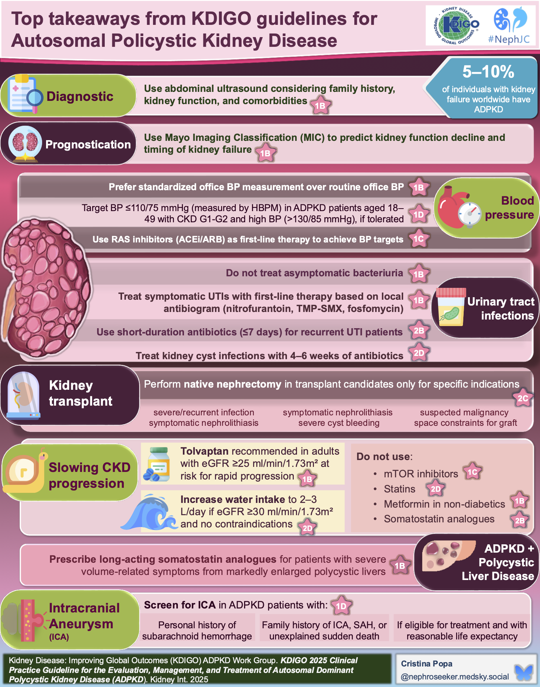
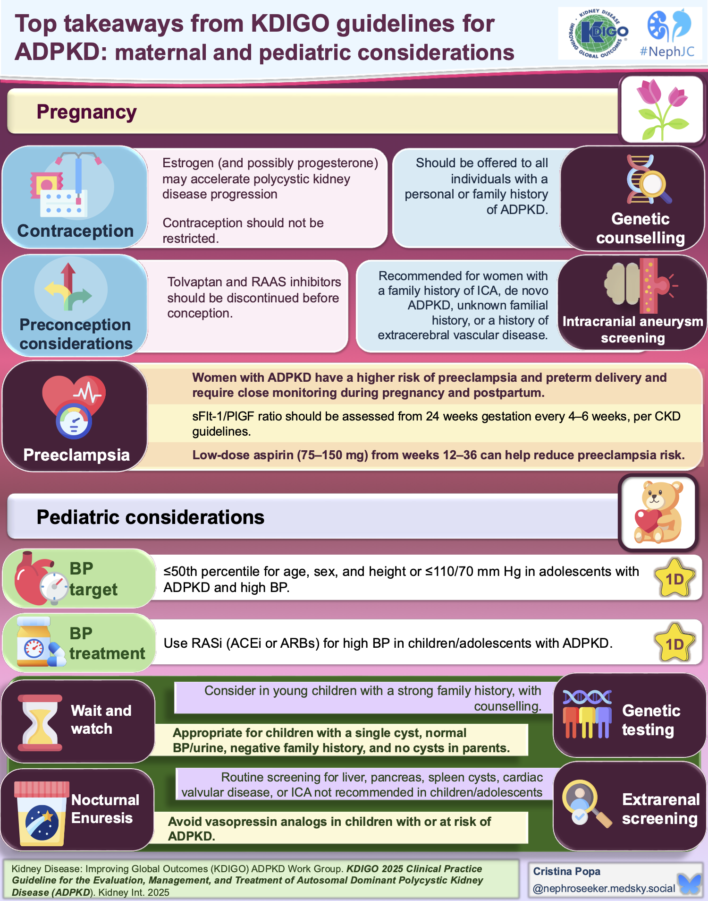

## KDIGO Guidelines

[Full guidelines here](https://pubmed.ncbi.nlm.nih.gov/39848759/)

The visual abstract on [NephJC](https://www.nephjc.com/news/2025/kdigo-adpkd-va) is really excellent, reproduced here, credit to NephJc and Cristina Popa.

## Useful links

[Mayo classification calculator](https://www.mayo.edu/research/documents/pkd-center-adpkd-classification/doc-20094754)

## Tolvaptan
-   Tolvptan: 30mg/60mgPBS, 1 pack, 5 repeats Code 888 
-   Monthly LFT for 1 months (set up 18 chart reviews)
-   LFT (AST,ALT,BILI) >2 ULN or 2X baseline hold and repeat
-   If >3x discontinue
-   UOSM < 280
