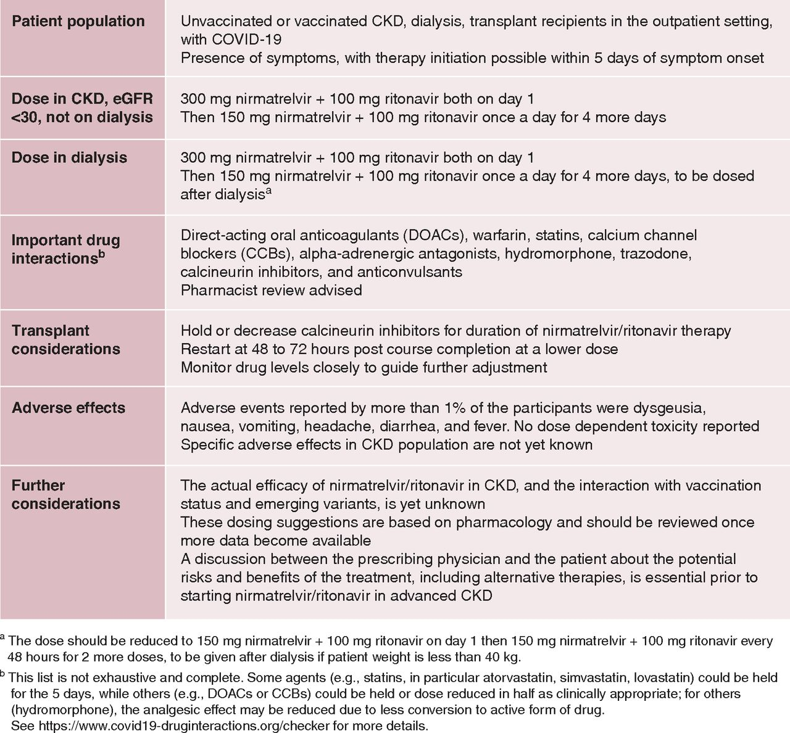
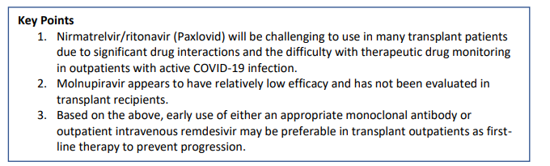

# COVID19

-   CKD higher risk for hospitalization (risk ratio, 1.6; 95% confidence interval, 1.3 to 1.9) 
-   mortality (risk ratio, 1.3; 95% confidence interval, 1.3 to 2.0) 
-   Never forget The initial RRT/Tx mortality in UK was 25% of hospital admissions ( pre vaccine era)

# Vaccines

-   RRT antibody response is 89% relative to healthy controls- wanes over time.
-   Tx recipients, antibody response ~ 35% with small increments to repeat vaccination. 
-   Omicron and later variants require higher antibody titers are required for viral neutralization

# Drugs

## Paxlovid

-   Nirmatrelvir is an orally administered antiviral agent inhibiting the SARS-CoV-2 3-chymotrypsin–like cysteine protease enzyme (Mpro), also referred to as 3C-like protease or nsp5 protease, which renders the protein incapable of processing polyprotein precursors and prevents viral replication
-   Ritonavir is a CYP3A4 inhibitor and enhances nirmatrelvir’s bioavailability
-   [EPIC-HR](https://www.nejm.org/doi/full/10.1056/nejmoa2118542) showed in high risk, mild-mod (non hospitalised) patients f COVID-19–related hospitalization or death by day 28 was 89% lower in the treatment group than in the placebo group. There were 13 deaths, all in the placebo group. 
-   No eGFR <30 in the group

[Prescribing Nirmatrelvir/Ritonavir for COVID-19 in Advanced CKD](https://cjasn.asnjournals.org/content/17/8/1247)

-   Nirmatrelvir has a molecular mass of 499.5 D, 35% is approximately excreted by the kidneys, and it is 70% protein bound. Ritonavir is mostly hepatically metabolized. Thus Nirmatrelvir will accumulate.
-   Adverse events reported by >1% of the participants were dysgeusia, nausea, vomiting, headache, diarrhea, and fever. In the phase 2 study with eGFR <30 ml/min per 1.73 m2, two of eight patients (25%) reported dysgeusia and dry mouth compared with none in the other arms with higher kidney function
-   Hemodialysis will clear a clinically insignificant amount of nirmatrelvir(, on the basis of what is known about its molecular size, protein binding, and volume of distribution. (prob)

***NB*** 
-   Drug interactions: potent CYP3A4 inhibitor and an inducer of other cytochrome p450 enzymes
-   If used in Tx patients even with eGFR >60 can spike tac levels 10x. proceed very cautiously / stop tac if used at all. 
-   Avoid in hepatic dysfn or eGFR <30 in tx setting.

[Tx guideance](https://www.myast.org/sites/default/files/AST%20Statement%20on%20Oral%20Antiviral%20Therapy%20for%20COVID%20Jan%204%20%282%29.pdf)

