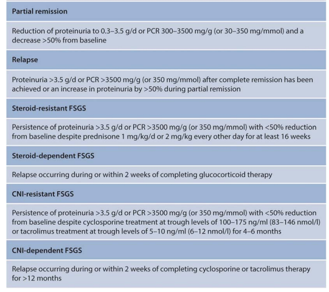
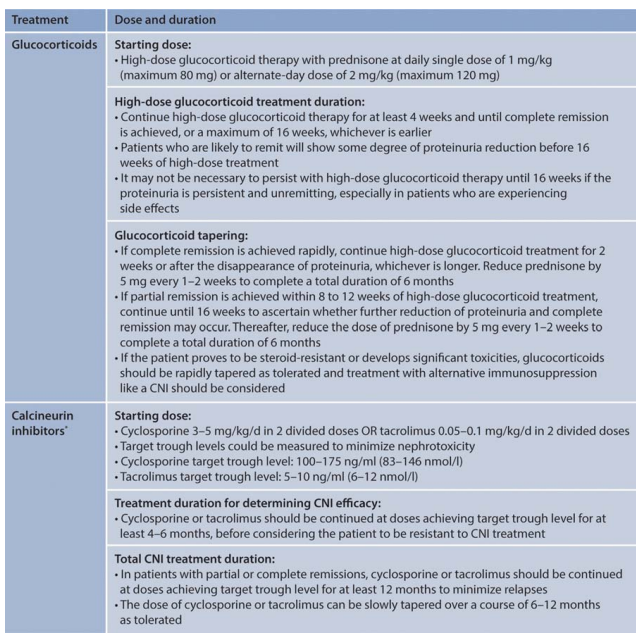
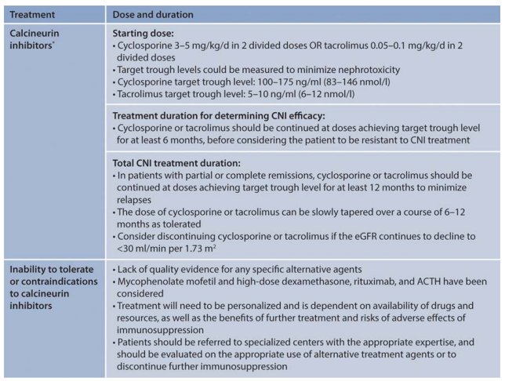

# FSGS

The classic **podocytopathy**

-   Huge aetiology for a relatively generic pathological pattern
-   Podocyte- 300-500 per glom in humans, don’t regenerate well
-   Pod depletion is central to the disease process – death, senescence, apoptosis -\>podocytopaenia -\> glomerlular sclerosis
-   During pod injury -\> misdirected filtration -\> adhesion of the tuft to bowmans capsule -\>progressive adhesions and scar
-   In animal models the podocyte depletion correlates with proteinuria and glomerular sclerosis
-   Seems there’s a threshold of maybe 20% of depletion before series disease kicks
-   On a spectrum of disease alongside MCD?

# Primary FSGS

-   Classic presentation – microscopy of the kidney biopsy demonstrates FSGS lesions, electron microscopy of the kidney biopsy demonstrates diffuse foot process effacement, and clinically the patients display nephrotic syndrome.
-   No other obvious cause of FSGS
-   Circulating factor? – supar- beta3integring?
    -   Cardiotrophin-like cytokine 1
    -   IL6 family
-   Returns after tx, Savin 2006(?96) NEJM- 33/56 tx’d recurred – PEX reduced the glom permeability to albumin here
-   Classic NEJM 2012 resolution of recurrent FSGS when a failing “recurrent FSGS” was tx’d into a second patient
-   Low serum alb
-   Bx: collapsing, tip lesion, NOS are all common
-   On the EM – foot process effacement, in contrast to secondary forms
-   Steroid sensitive or dependant. Responsive to IS – if not improving consider if secondary and screen
-   Steroids: 1mg/kg, max 80mg, 16-week max trial, if respond give \>=6 months. CNI/cyclosporine alternative
-   Spontaneous remission rates are \>20%.
-   NS have worse kidney prognosis than non-nephrotic patients, with 10-year kidney survival rates of 57% compared to 92% in those with lower degrees of proteinuria
-   Response of proteinuria predicts outcome Troyanov JASN 2005
-   40% don’t response to steroids – only 20% renal survival in this group
-   Adults with FSGS who do not have nephrotic syndrome should be evaluated for a secondary cause

# Maladaptive

-   Glom load\>capacity – hyperfiltering and stretching podocytes
    -   Unilateral renal agensis, hypoplasia
    -   Renal ablation
    -   Obesity
    -   Absolute unit
    -   Extensive nephron loss from other diseases e.g. GN
    -   Oligomeganephronia
-   Typically normal albumin, but can have nephrotic range proteinuria
-   May lack oedema
-   Large body size ?Premature birth
-   Bx: large gloms, glom scars tend to perihilar (\>-50%)
-   Often responds to conservative therapy – ACEi/ARB low dose thiazide, NA restrict
-   Lose weight, stop anabolic steroids

# APOL1 FSGS

-   Serum lytic for T.b.Brucei. G0/G0 susceptible. G1/G2(or G2) risk of CKD.
-   Single allele may be enough to increase risk/trigger FSGS
-   Diseases tend to progress faster if homozygous
-   Fertile soil hypothesis: Podocytes (maybe vascular cells) are more susceptible to injury due to altered endolysomal function or inflammatory signalling
-   Gorillas have risk alelles, chimps don’t. mice don’t.
-   Aboriginal Australians likely don’t as they arrived in Australia 50000 years ago after an African migration 72000 years ago. It is thought the APOL1 G1 and G” arose in sub Saharan Africans only about 5000-10000 years ago. ( https://www.kidney-international.org/article/S0085-2538(17)30086-8/fulltext)
-   72% west African/sub–Saharan FSGS
-   Can manifest in various ways due to additional factors: Associated with HIVAN, aterionephrosclerosis (misattributed to HTN perhaps), sickle cell (RR3.4), prematurity, drug induced (interferon),eclampsia (RR 1.6)
-   Transplant: Risk in donor genotype (HR 3.8) ( no effect in recipient)
-   Seems to explain about 75% of HIVAN and even much of “primary” FSGS in case control studies
-   **No different in steroid sensitivity between APOL1 risk alleles vs G0**
-   No meaningful change in response to therapy

#  Genetic FSGS

-   Up to 20% of steroid resistant FSGS patients ( yaeo et al CJASN 2019) – about 55% col4a3/4/5, 40% podocyte and 5% CAKUT genes
    -   Mendelian AR AD
    -   Mitochondrial
    -   X-linked
-   Typically slit diaphragm/podocyte defects
-   Family hx/ consanguinity
-   Extra renal manifestations – skeletal, neurological, eye, ear, urogenital
-   Why – might help prognosis and hunt for extra-renal manifestations, transplant and family implications, family closure
-   Acetyl Q10 in some diseases – worth checking
-   Steroids generally don’t work, CNI’s might
-   Good Conservative care vital
-   Whole exome sequencing probably overtaking the panels

# Virus

-   HIV = interferon drives APOL1 gene expression
-   CMV- collapsing FSGS
-   Parvo b19?
-   EBV?
-   Simian virus 40
-   Hepatitis C
-   SARS-COV 2 ( with APOL1)

# Meds

-   Interferon – drives APOL1 gene expression
-   Bisphosphonates - collapsing
-   lithium – primary phenotype
-   CNI - adaptive
-   Amphotericin
-   Heroin

# Misc

-   Cholesterol crystal embolization
-   Renal artery stenosis
-   Rejection
-   Aging
-   Congenital cyanotic heart disease

# Treatment

figures from KGIDO GN 21

## Rx Notes

-   Podocytes love steroids, seems to strengthen the cytoskeleton
-   CNI (nat med 2008 Faul,C) – stabilises synaptopodin
-   ?voclosporin
-   Rituximab – appears to stabilised podocyte membrane also (ravani et al CJASN 2016)
-   Sparsentan – Endothelian1/ARB – DUET – decreased proteinuria, phase 3 ongoing
-   CCR2 antoagonism
-   Abatacept in B7-1 prositive proteinuric kidney disase 9 NEJM13
-   VEGFr is an attractive signalling pathway as is TGFB-TGF-R1 ( could my drug work here?)

## Steroid subtlties

Glassock on the ASN forums:

This discussion would not be complete without a  critique of how we (arbitrarily) define resistance to steroid therapy in apparently  Primary FSGS  in Adults.  The group in Nijmegen, Netherlands  have added some important information to this quandary .  Prolonged steroid therapy (well beyond the time used by KDIGO  to define 'steroid resistance " can be beneficial long term especially if   there is an early decline in Proteinuria of > 20% from baseline  ( see Rood UM, et al KI Reports 2022; 7: 87-92).  Also , in those who experience a partial or complete remission with steroids early in the course, maintenance of the remission can be crucial for long term benefits. ( see  Jauhal A, et al NDT, August 10,2022). 

## Kitchen sink

## Resistant FSGS

Per Glassock on the ASN forums

# misc - compile and order later
https://jasn.asnjournals.org/content/29/3/759

1) primary vs secondary cause

2) nephrotic syndrome vs nephrotic range proteinuria

While not 100% in most cases, nephrotic syndrome and FSGS usually is going to have a primary cause( sparing some genetic causes and viruses). In addition, what is also helpful from a pathology standpoint is not the LM, but the EM-- 

3) Is there diffuse or partial foot process effacement?- Usually the former responds to treatment better with steroids or other immunosuppression and later is more likely a secondary cause. It may also aid in looking for a secondary cause.

Classically, your "permeability or immune mediated" FSGS should respond to treatment and would fit under nephrotic syndrome, diffuse foot process effacement and classically your primary FSGS.  Secondary FSGS from various causes like low nephron mass, obesity, viral , meds- all classically would have nephrotic range proteinuria and sporadic foot process effacement on EM.

-   no one really knows what is the optimum approach to such patients. Desparate but unproven measures are commonly undertaken- such as the "kitchen sink" regimens of multi-target therapy or PLEX/lipid Apheresis.  dramatic effects can be seen (anecdotes) but impossible  to predict.

-   ESKD and dialysis dependency are common no matter what is done, in most  cases.

-   the risk of recurrent disease in the allograft is very high, if a  genetic disease is excluded

-   the role of repeat biopsy is completely unknown, although it might be used to declare futility or to enhance the likelihood of CNI toxicity in selected patients.

-   progressive elevations of serum creatinine suggest a poor outcome , except when CNI  is strongly suspected .  Regimens including CNI are potentially hazardous in such patients .

-   referral to a Center of Excellence for consideration of enrollment in an  ongoing interventional trial should be strongly encouraged.

KDIGO: FSGS-UC (for undetermined cause). It is conceivable that patients with FSGS-UC have secondary or genetic forms of FSGS that have not yet been elucidated

FSGS –histological variants – unsure how useful this really is clinically

-   Collapsing
-   Perihilar
    -   Common variant
-   Cellular
    -   Increased podocytes
-   FSGS NOS
    -   Garbage bag of everything else
-   TIP variant

May have segmental scar (classic, tip and perihilar) which can be missed and misdiagnosed as MCD – these can often be later reclassified as “presumed FSGS wen the patient doesn’t get better)

