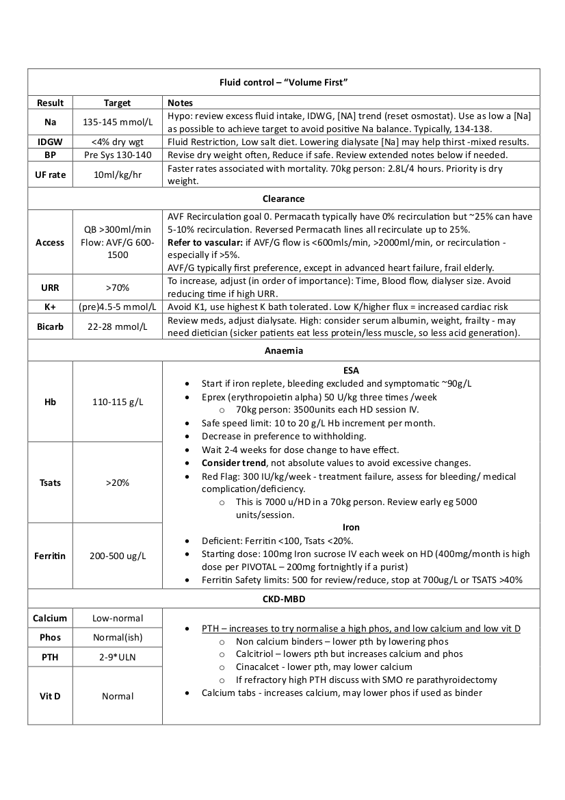

#  Core principles

-   Consider suitability for home haemo/PD and review tx listing status
-   **Customise** dialysis regime to patient.
-   Ensure adequate volume control as a key primary priority
-   Bloods: Reflect on trends, rather than individual results.
-   Dialysate: avoid positive sodium balance, positive calcium, high K gradients. Avoid dialysate Mg \<1, K \<2, Ca2+ \<1.5.
-   Aim for your targets, but within the context of that patient, and not at the expense of personalised care.
    
#  Volume First

    
A [Volume first approach](https://pubmed.ncbi.nlm.nih.gov/25156305/), major CV contributor. Light on evidence, but compelling. Extending treatment time or frequency is an effective way to address volume control and tolerance of dialysis sessions, with less dialysis-related morbidity and mortality

### notes

-   BP should be normal throughout, high post HD BP ?wet
-   Can take \~3 months to get to a first dry weight – persistence is key
-   Early tapering of BP meds may help hit dry weight by avoiding hypotension (?evidence?)
-   Hypotension/cramps = refill capacity. Does not necessarily mean at dry weight
-   BP normalisation can lag weeks after ECF volume normalisation (allegedly ?evidence)

# Adequacy

**URR:** ((Pre urea-post urea)\*100)/Pre-urea

-   Underestimates due to ignoring urea clearance during UF and intra HD urea generation
-   Target 70%. Mostly a Fn of Time and Qb in that order.

**Single Pool Kt/V**

-   Accounts of size by using TBW in formula

-   Urea Clearance(K)\*Time(T)/Vd of Urea (55% TBW in men, 50% in women)

-   Target 1.4, min 1.2

**Equilibrated Kt/V**

-   Optimal

-   Wait 30 mins for equilibration before second sample

## HEMO study
 

[HEMO](<https://www.nejm.org/doi/full/10.1056/nejmoa021583>)

-   1846 patients 3\*week HD

-   Primary outcome: death

-   Secondary outcome: hospitalization for cardiac causes or death from any cause, first hospitalization for infection or death from any cause, first 15 percent decrease in the serum albumin level or death from any cause, and all hospitalizations not related to vascular access

-   Results: No difference between high dose (Kt/v 1.7, URR 75) vs low (Kt/V 1.16, URR 66). No difference between high flux and low flux.

 

# Anaemia & Iron

Has its own page [here](https://www.renalmedicine.net/anaemia.html)

# HD Prescription tips

-   Lower temps = may have greater tolerability and possibly CV/Neuro outcomes in selected patients,
-   Qb 300-500, Qd 500-800
-   Initiation: 2hr Qb200 Qd500 ,3hr Qb250 Qd500 ,4hrs Qb300 Qd800.
-   Never use a 0/1 K+ bath (if its even an option) – too much K flux unless you really really need to lower it
-   Post Tx: avoid hypotension (assoc. with increase risk of acute rejection)
-   Acidaemic: Check ionised Calcium – the incoming bicarb load will drop the iCa - \>seizures etc

## MyTEMP
 

[MyTEMP](https://www.thelancet.com/journals/lancet/article/PIIS0140-6736(22)01805-0/fulltext)

-   cluster randomised Canadian trial, 36'5c Vs 0.5c less than body temp.
-   Pragmatic and excellently done, healthy budget and embedded in care
-   The primary composite outcome was CV-related death or hospital admission with MI, stroke, CCF during the 4-year trial period
-   15413 patients, 4.3 million HD sessions
-   mean dialysate temperature was 35·8°C in the cooler dialysate group and 36·4°C 
-   mean drop in intradialytic sys BP  26·6 mm Hg in the cool HD vs 27·1 mm Hg in the standard temperature group (mean difference –0·5 mm Hg, 99% CI –1·4 to 0·4; p=0·14)

 

# Severe Uraemia

-   Pericarditis is a clinical diagnosis
-   **Rx:*** Daily HD, no anticoagulation
-   Check for pericardial effusion 
-   Chest pain – improves leaning forward, friction rub, distant heart sounds. Fever/sob. BP low. Tachycardic.
-   **ECG:** Diffuse ST & T wave elevation – not typically coronary territory. electrical alternans = pericardiocentesis. Trop leak.
-   **JVP:** Kussmaul's sign is a paradoxical rise in jugular venous pressure (JVP) on inspiration
-   **Pulsus paradoxus: aka exaggerated respiratory variation**
-   Inflate 30mmHg above pulse. Note first intermittent Korotkoff sounds. (higher systemic BP occurring during expiration). Slowly deflate cuff until highest BP with continuous beat. The delta is the pulsus paradoxus. \>10mmHg suggest tamponade.
 -   **CXR:** Increased cardiac silhouette
-   **ECHO:** Effusion in 50% of uraemic pericarditis. Repeat echo to ensure resolution 3-5 days.
-   **D.Dx:** Infectious/inflammation(SLE/vasculitis), neoplastic, meds(hydralazine)

 

# Bicarb

**Bicarb target : \> 22 – 28**

**Notes**

-   Total carbon dioxide [CO2], generally 1–1.5 mEq/L higher than the serum bicarbonate concentration, is actually what is measured in all epidemiologic studies
-   High and low bicarb [associated with poorer outcomes](https://www.kidney-international.org/article/S0085-2538(16)00278-7/pdf) (\<20), sicker patients eat less protein, resulting in less acid generation.
-   European Best Practice Guidelines suggest maintaining midweek predialysis serum bicarbonate at 20–22 mEq/L
-   Low or high values tend to return to baseline, only 3 month mean values tend to stick around, so a single abnormal reading is unlikely to be significant. Regression to the mean.
-   Rapid increase in blood BIC/PH: hypercapnia, arrythmia, haemodynamic instability, possibly immune dysfunction/infection, electrolyte ( drop in Calcium, K+ driven by PH)

Sources: KDOQI , [excellent review in JASN](https://www.ncbi.nlm.nih.gov/pmc/articles/PMC5328170/) and [summary in KI](https://www.kidney-international.org/article/S0085-2538(16)00278-7/pdf).

# Vaccinations

**HEP B – 1/3 don’t respond. At 1 year, only about \~64% have adequate Ab protection**

-   **HBVAXPRO** 40 micrograms at 0, 1 and 6 months by IM injection. Not in buttocks – go deltoid – better response.
-   **Fendrix** -20micrograms at 0,1,2 and 6 months
-   **Engerix** B -40 micrograms at 0,1,2 and 6 months

Check anti-Hbs antibodies 1-2 months after course.

-   **Responder**: \>100mIU/ml .
-   **Partial response**: 10-100mIU/ml. Give booster (once) and recheck in 1-2 months.
-   **Non response**: \<10mIU/ml. Repeat entire course once only. If still \<10mIU/ml, then patient is a ‘non responder’ and move on. If level 10-100mIU/ml then treat as partial response.
    -   If non response, check for ABsag and either proceed as acute infection if + or “vulnerable”
    -   HBIG postexposure prophylaxis for any known or likely parenteral exposure to HBsAg positive blood is available.
-   Once established, annual check with a booster if \<100mIu/ml.

**Notes:**

-   Better immune response and high rates of conversion if given before ESKD
-   If started on normal dose pre HD but transitioning to HD during vaccine course, increase to the double dose (40mg) once on HD
-   Ab tires \>10 are still protective

**Other Vaccines**

-   Annual inactivated influenza
-   Pneumococcal: Regime varies depending on history and PCV13/PPSV23: See table 2 and table 3 of the appendix of CDC document [here](https://www.cdc.gov/dialysis/pdfs/vaccinating_dialysis_patients_and_patients_dec2012.pdf) 
-   [Green book](https://www.gov.uk/government/collections/immunisation-against-infectious-disease-the-green-book#the-green-book)
-   COVID probably

# Guidelines & Protocols & Papers

[Venous catheters - great overview](https://www.sciencedirect.com/science/article/pii/S2468024921014509)

[KDIGO](https://kdigo.org/guidelines/)

