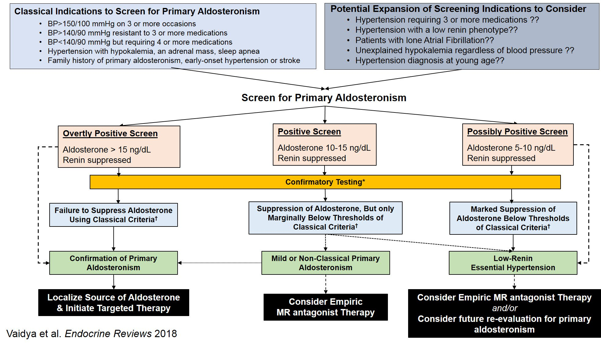
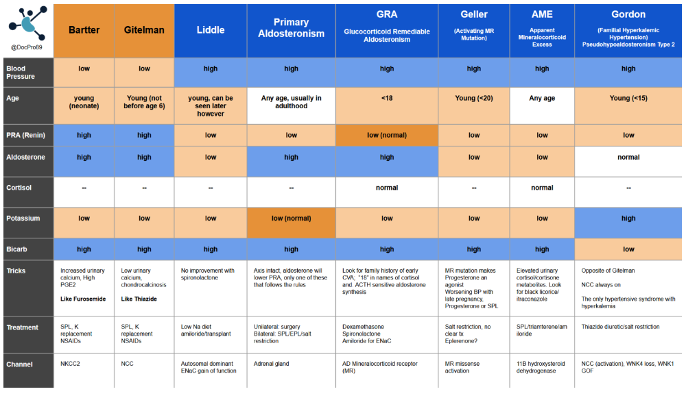
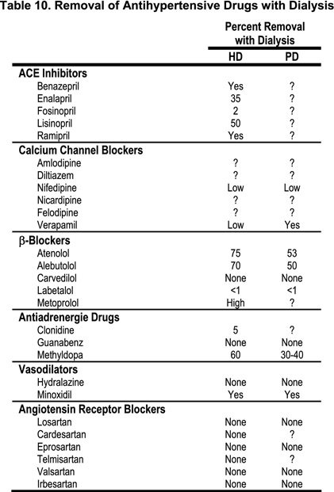

# HTN

When considering the pragmatic sort of home /office readings typical in practice, 130/80 is the target. Lower is probably fine if not even [better](https://www.nejm.org/doi/full/10.1056/nejmoa1511939) so long as it is asymptomatic.

An generally appropriate regime would be starting a good ARB to allow polypill options

1. Olmesartan 
2. Olmesartan + amlodipine 
3. Olmesartan + amlodipine + Hctz
4. Spironolactone ( if K+ allows, caution 4.5-4.8, probably avoid , or address K first if >4.9.)
5. If volume still an issue try Frusemide. 
6. If prostatism consider alphablocker  such as prazocin (BD).
7. Only If other indication ( heart failure/ fast AF etc ) consider a betablocker 
8. Scraping the barrel here, hydralazine, moxonidine , clozapine path ( not available in Australia - avoid tablets due to major lability issues) 

### Notes

Typically, adding in a second/third agent is more impactful than maxing the dose of the initial agents (although max RAS blockade when proteinuria as a priority). Adding agents rather than doses may lead to less side effects.

Consider whether patient is primarily a sympathetic driven pictures, versus more volume sensitive

The timing of meds probably [doesnt matter](https://www.thelancet.com/journals/lancet/article/PIIS0140-6736(22)01786-X/fulltext#:~:text=The%20TIME%20study%20is%20a,at%20least%20one%20antihypertensive%20medication.) I dont buy the [HYGIA trial](https://www.ahajournals.org/doi/10.1161/HYPERTENSIONAHA.121.17356), its a bit suss.

**Betablockers**

Probably use carvidolol unless other indications, avoid [atenolol](https://www.escardio.org/Journals/E-Journal-of-Cardiology-Practice/Volume-8/Betablockers-in-hypertension-acquiring-a-balanced-view) in non dialysis patients, although it may reduce CV outcomes in HD patients

**Diuretics** 

Chlorthalidone 12.5mg a day and uptitrated can be used in [eGFR 15-30](https://www.nejm.org/doi/full/10.1056/NEJMoa2110730) and still have an effect - 10mmHg. Respect the electrolyte disturbances which are common (10% hypoK). 

Hctz is [probably similar](https://www.nejm.org/doi/full/10.1056/NEJMoa2212270#:~:text=Previous%20studies%20have%20suggested%20that,19%20and%20other%20pleotropic%20effects) to chlorthalidone in the average patient with potentially less hypokalaemia. Reassuring if you dont believe in the mystical potency of chlorthalidone and cant find it compounded in a polypill (Azilsartan in US, but none available on PBS)

Probably no massive value in swapping out hctz for chlorthalidone, although may well be better in those who struggle with medication concordance or very resistant due to high half life. Will need to break the polypill up however. 

**ARB**

Olmesartan is potent and has long half life. Valsartan also good choice. Less side effects with ARB vs ACEi so potentially better compliance.

**CCB**

Lercandipine is similar to amlodipine in terms of efficacy, will less vasodilatation/ peripheral oedema.

# Primary hyperaldosteronism

-   Unclear prevalence, possibly underdiagnosed, likely \>10% in resistant HTN
-   normalising BP may not be sufficient reduce CV risk; probably still need some degree of receptor blockade

## Screening questions

-   Resistant hypertension (defined by the [US Guideline](https://www.ncbi.nlm.nih.gov/pubmed/29133356) as BP \> 130/80 mm Hg with 3 or more drugs at optimal dosages, including a diuretic)
-   Spontaneous or diuretic induced hypokalemia
-   Hypertension with an incidentally noted adrenal tumor
-   Family history of primary aldosteronism
-   Family history of premature stroke (age \< 40 years)
-   Hypertension and sleep apnea

## Screening test

**Renin:Aldo Ratio**

-   Plasma Renin threshold (ng/mL/h): \<1.0  or < 8 pmol/L ( i.e. suppressed) 
-   Serum Aldosterone (ng/dL): \>= 15 (405 pmol/L) (other thresholds exist e.g. 20(540) is conservative, 6(162) is too permissive. 15(405) is fairly widely accepted)
-   ARR (ng/dL per ng/mL/h) \>= 30 or >91 pmol/mU

Conversion factor: Aldo 1 ng/ML = 27.7 pmol/L

Conversion factor: PRA (ng/mL/h) to DRC (mU/L) is 8.2

- If ARR >91, but aldo < 280 pmol/L probably a false positive ratio

False negatives:

-   hypokalaemia (supresses aldo production, so normalise pre test)
-   MRA usage (less often with ACEi/ARBS)
-   BB blockers, diuretics, salt restriction

## Confirmation tests

Oral Sodium suppression test ( sodium should supress aldo)

-   Increased dietary sodium to \>200mmol/D for 3-4 days
-   Measure 24 urine sodium, creatinine and aldo excretion at tend

Result: 24 hour urinary aldo excretion rate \>12-14 ug (conservative) or even 10 (permissive)

**Supine IV saline suppression**

-   1 hour supine rest
-   Infuse 2L of NS over 4 hours
-   Measure PRA and serum aldo before and after infusion

Results: post infusion aldo of \>10 (most permissive \>5)

[Fludrocortisone suppression and captopril challenge](https://www.ncbi.nlm.nih.gov/pmc/articles/PMC6260247/) can be used also

[Great review](https://www.ncbi.nlm.nih.gov/pmc/articles/PMC6260247/)

## Notes

-   Secondary hyperaldosteronism in a young female one must be suspicious of an eating disorder.

-   Trifecta of spontaneous hypokalemia, suppressed renin, and elevated plasma aldosterone do not need additional confirmatory testing

## Monogenic HTN 

Created by Dr James Luther (@DrJMLuther) published via [Renal fellow network](https://www.renalfellow.org/2018/11/19/raas-is-your-friend-pocket-guide-to-heritable-blood-pressure/)

## Blood pressure in Dialysis

**Blood pressure**

*NB: There are no robust data on optimal BP targets.*

**Target: 130-140 systolic** is reasonable target, however, must be individualised, considering intra/inter dialytic BP patterns, volume management and comorbidities*.*

**Peri dialysis 130-149 systolic**, and post 120-140. (Based on [DOPs](https://pubmed.ncbi.nlm.nih.gov/15486868/) – group with best outcomes, albeit with non-standardised readings)

Frailer patients and those prone to intradialytic hypotension with life expectancy of less than 2 years may benefit from systolic BP of over 140 systolic to allow safe HD and minimise intradialytic hypotension.

While optimal peridialysis BP has not been demonstrated in any trial data, [Observation data]((https:/www.kidney-international.org/article/S0085-2538(17)30418-0/pdf)) suggests worse outcomes with lower BP, typically \<= 120sys, and best outcomes in the 140-160 range

Despite the ambiguity, is worthwhile treating hypertension in patients on dialysis, [as meta analysis](https://www.sciencedirect.com/science/article/pii/S0140673609602129) suggests a reduction in all-cause mortality.

This [KDIGO summary](https://kdigo.org/wp-content/uploads/2017/05/KDIGO-BP-Volume-in-Dialysis-FINAL.pdf) is excellent summary of the state of the field

**Measurement**

-   Ambulatory – gold standard.
-   Home BP: encourage home monitoring of BP, more accurate and reproducible than peri dialysis measurements, and more achievable than ambulatory readings. 1-2 weeks, twice a day capturing the non-dialytic days.
-   Well performed, non-dialysis day measurements in clinic are next most useful.
-   Peridialysis BP: useful for monitoring tolerance to HD, uncertain how well these readings represent average BP.

**Note:** Leg BP are about 17 mmhg higher systolic, and a threshold of 155/90 is reasonable for the diagnosis of HTN. Consider that PVD will lower leg pressures, and heavily calcified vessels may obscure things further. In such patients, BP trends may be more useful than absolute readings, but the interpretation is challenging.

**Treatment**

First ensure dry weight is achieved, and if any uncertainty, discuss with patient and nursing staff and trial a reduction in weight if safe to do so.

Secondly, revisit dry weight again, and convince yourself again that you have indeed explored this and are satisfied the patient is at the optimal weight.

Its reasonable to choose antihypertensive medications as you would in non-dialysis patients, with the following notes.

The evidence surrounding the efficacy of dialysable anti-hypertensives versus non dialysable agents is [mixed](https://kdigo.org/wp-content/uploads/2017/05/KDIGO-BP-Volume-in-Dialysis-FINAL.pdf). Its reasonable to avoid non-dialysable agents in patients with intradialytic hypotension. In stable patients, non dialysable agents may provide more predictable and homogenous cover.

-   ACEi/ARB: May reduce LB mass, may preserve PD patients residual function. Mixed CV outcome data.
-   Bblocker: Less CV death with atenolol vs lisinopril, and less death with carvediolol vs placebo in dilated CM on RAS blockade already.
-   CCB: Less CV death – Amlodipine vs placebo
-   Diuretics: if residual urine output may help
-   MRA: Probably better CV outcomes, ongoing trials.

Despite being common practice, its currently unknown and under investigation whether adjusting timings of medications around dialysis or holding on dialysis days help avoid hypotensive episodes.

It may not matter which any hypertensive agents are used but it is interesting to note that trial data suggested atenolol was [superior to lisinopril](https://academic.oup.com/ndt/article/29/3/672/1866831), and [spironolactone](https://www.sciencedirect.com/science/article/pii/S0735109713057380) and [telmisartan ,in addition to ACEi](https://www.sciencedirect.com/science/article/pii/S0735109710038118)  have demonstrated reduced mortality. While dual blockade may upset the faint of heart, note this is different population to [VA NEPHRON-D](https://www.nejm.org/doi/full/10.1056/nejmoa1303154#:~:text=Design%20and%20Oversight-,The%20Veterans%20Affairs%20Nephropathy%20in%20Diabetes%20(VA%20NEPHRON%2DD),in%20slowing%20the%20progression%20of) who were proteinuric diabetic nephropathy patients with eGFR \>30, not on RRT. Id avoid dual blockade thanks.

 

