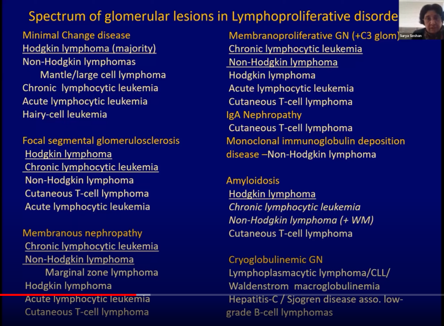

# Lymphoproliferative disorders & renal disease

All of them can affect kidneys: Hodgkins/non- hodgkins, post immunosuppressive (EBV etc) CLL, Waldenstroms etc

Almost all patterns of injury can occur. The unique factor is that a **monoclonal protein may light up on the IF.** Hence the benefit of doing Kappa and Lamda and CD3,CD20 when suspicious.

### Renal involvement

-   Direct infiltration
-   Glom/tubulointerstitial/vascular lesions due to monocloncal protein
-   Glom lesions due to cytokines
-   Paraneoplastic (amyloid, acid-base)
-   Intravascular invasion – gloms can become occluded by the atpypical lymphoid cells- A wee bit like tx glomerulitis – AKI, fever, weight loss
-   Indirect: nephrocalcinosis, tumour lysis, hyperviscosity syn, DIC, TMA, TIN, Drugs

### Glomerular lesions:

**Hodgkin:** MCD, FSGS, AA Amyloid

**Non-Hodgkin:** T cell Cytoine med podocytopathy, MCD, FSGS

**B cell with monocolonal gammopathy:**

-   Cryoglobulins – granular/tubule-fibrillar
-   Non cryos: granular/tubule-fibrillar/crystalline
-   Other: AL amyloid, cast nephropathy, light chain tubulopathy

**CLL** can make a gammopathy and has a tissue phase

**Waldenstroms** is the lymphoma that pumps out IgM. 30-40% of IgM kappa can be cryoglobulins, so test for same if you find it on bx.

# Suss

-   Older age group
-   History of MGUS/lymphoma – can be historical
-   Any abnormal pattern on bx, anything weird about an interstitial infiltrate ( like monomorphic, nesting and clumping a bit)
-   Get a CD3 (t-cell marker) CD20 (B- cell marker) and Kappa and lamda LC stains

# Notes

-   Treat the underlying cause to improve/cure kidney disease

-   Kidney recurrence can herald lymphoproliferative recurrence, or be a first presentation/predate

-   Wide age range of patients but many series report older predominance (\>60) ?male

-   Duration between lymphoma and renal disease can be \>10 years

-   In glomerular lesions, tend to be CKD picture, nephrotic syndrome common, about 20% haematuria, gammopathy common, 60% perhaps

-   In parenchymal lesions, no NS obviously, only about 13% have a gammopathy but mass on imaging sometimes

-   LN and BM biopsy useful adjunctive tests

-   Primary extra nodal lymphoma in a kidney is a thing, but extremely rare

-   **Make friends with a haematologist** 

# Resources

[Nice Glomcon on the topic](https://www.youtube.com/watch?v=xmF6K3-yygA)

