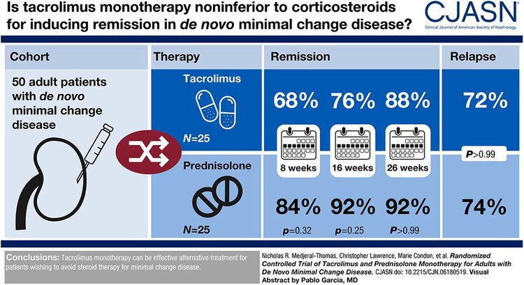

### Minimal Change Disease

* ~10-15% of NS
* 30-50% can remit without treatment but may take up to 2 years
* Probably can progress to FSGS
* Over 80% of adults with MCD are steroid responsive. 
* 50-70% of adult patients will  relapse 
* 1/3 patients may become frequent relapsers or steroid dependent [Waldman et al, cJASN 2007](https://cjasn.asnjournals.org/content/2/3/445). 
* Rapid onset of nephrotic sydrome
* 15% of adult cases are secondary: nonsteroidal anti-inflammatory drugs, lithium, and lymphoproliferative disorders
* Hypertension (25%–50%), hematuria (20%–30%), and AKI ( ATN? )(20%–25%) are more common in adults
* Rarely can lead to CKD, or even ESRD ( <5%)
* Anticoagulation: lower risk but perhaps if resistant?

### Typical Steroid Course
* Remission in ~50% adults by 8 weeks, 75-95% by 16.
* 1mg/kg, max 80mg po od - 4 weeks minimum, up to 16 weeks if waiting on remission
* Run 2-4 weeks post remission
* Reduce to acheive total treatment of  4-6 months

### Relapse
* Common, 65-80%
* Usually first 3-6 months post remission
* Age <45 relapse more (?better immune system?)
* 1st relapse - repeat pred course
* 2 * courses in 6/months or 4/12 = frequent relapser
* 10-30% are frequent relapses and 15-30% are steroid dependant
* Probably reasonable to give ritux although weight of evidence us for cylophos.
[Ruggenenti et al JASN 2014](https://jasn.asnjournals.org/content/25/4/850?ijkey=f2dc13c5abc54176d3ad3875aaf8460ec301ee27&keytype2=tf_ipsecsha)
* RTX (4 weekly doses of 375 mg/m2
* Cyclophos po ~2mg/kg po od * 8-12 weeks. ( note dose adjusted by age & eGFR)
* Partial remission is rare - rebiopsy for missed FSGS on bx?

## Anti-Nephrin antibodies

[Heres a pretty good freely filtered](http://www.nephjc.com/freelyfiltered/42/anti-nephrin-antibodies-cause-mcd) where the author [Astrid Weins](https://twitter.com/AstridWeins) is interviewed - really enlightening ideas. Some conceptual highlights included

* Fine granular IgG dusting on **almost all** MCD bxs !?
* MCD-FSGS spectrum
* ~30% of MCD disease have circulating anti-nephrin antibodies (NEPTUNE cohort)
* Anti-nephrin is basically the perfect assault molecule vs slit diaphragm.
  * IgG is freely filtered - just zooms past the slit diagram, is continually replenished, hours of affinity perhaps, and it gets instagibbed. Slit diaphragm integrity disrupted.
  * Doesnt need to accumulate and cause immune complexs( unlike anti-PLAR2)
  * The antibody/antigen balance is probably very subtle and minor effects will shift clinical picture ( steroids etc)
  * Fastest responders seem to loose ab over days.
  * No antibodies in patients in remission.
  
## The pathology of acute nephrotic syndrome in MCD

  * Effacement = nothing goes through = higher pressure
  * disrupted structure results in Bigger pore size
  * Nephrotic syndrome ramps up the pressure and overcomes the negative charge of the endothelium which allows negative albumin.
  * Therefore dont need to alter endothelium, just need to overcome it via ramping up pressure/pore size ( ?via nephrin -> actin cytoskeleton disruption)

## Recurrance post tx

Rare. not sure how this fits with FSGS high recurrance.

Adult data here **

In rare cases [Recurrance post tx](https://www.ncbi.nlm.nih.gov/pmc/articles/PMC4212136/) of congenital nephrotic syndrome is thought to be driven by anti-nephrin abs ( and responds accordingly to b-cell depletion)
re paediatrics,  in congential (primary is typically AR vs NPHS1(nephrin)/NPHS2) nephrotic syn and tx:

* Recurrance is rare in congential forms
* Return of proteinuria is common in non congenital forms (80% of total)

## Mintac

The [mintac trial](https://pubmed.ncbi.nlm.nih.gov/31953303/)

* Oral tacrolimus at 0.05 mg/kg twice daily vs or prednisolone at 1 mg/kg daily up to 60 mg daily.
* The primary outcome was complete remission of nephrotic syndrome after 8 weeks of therapy.
* Secondary outcomes included remission of nephrotic syndrome at 16 and 26 weeks, rates of relapse of nephrotic syndrome, and changes from baseline kidney function.

**Mintac Protocol**

* Everyone got Acei, statin (if required)
* Run tacro levels 6-8
* At week 8, if inadequate clinical response, target blood trough level was **increased** to 9-12 ng/ml. 
* 12 weeks after achieving complete remission, tacrolimus doses were titrated down over 8 weeks and stopped.  
* Participants in prednisolone arm received an initial dose of 1mg/kg per day with a maximum dose of 60 mg/kg per day. 
* One week after achieving complete remission, the steroid dose was halved for 4-6 weeks then gradually reduced and stopped over a further 6 weeks. Patients received a minimum of 16 weeks prednisolone. Bone and gastric protection was with calcium carbonate/cholecalciferol (1000mg/800IU) two tablets daily and omeprazole 20mg daily
* Complete remission was defined as uPCR <50 mg/mmol
* **Results** non inferior

# Guidelines & Protocols

[placeholder]()

# Key Papers

 

[Nature reviews Nephrology: MCD-FSGS spectrum ](https://www.nature.com/articles/nrneph.2016.147)

* Early FSGS must have some early podocyte injury  - some believe this is the same intial injury and FSGS is end game
* Genetic / environmental factors 

[CJASN: nice review on clinical features of MCD ](https://www.nature.com/https://cjasn.asnjournals.org/content/14/6/911/nrneph.2016.147)

 

# Educational

links here

# Patient materials

links here

