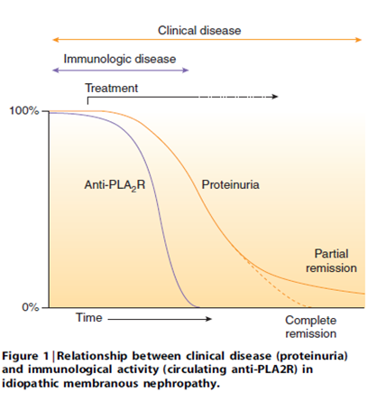

dont need spikes on bx, subepithelial deposits on the EM will do

## Membranous like glomerulopathy with masked IgG Kappa deposits

-   Light microscopy = classic MN, 25% proliferative changes. Routine Negative IF. But on EM you can see the sub epithelial, and mesangial changes.

-   Paraffin IF – opens up epitopes for ab to bind. Lights up the masked IgGk deposits.
-   Laser capture microdissection suggests serum amyloid P might be an antigenic target
-   Young females, preserved renal function, nephrotic range proteinuria, 55% positive ANA, 2% met SLE criteria
-   Orphan disease - treatment unclear, 44% CKD/ESKD.
-   Can recur in transplant.
-   Probably an autoimmune disease rather than paraprotein disease.

## MISC

Idiopathic membranous can antigen switch (e.g. IgG1 early and IgG4 later in disease)

## NELL 1

-   NELL 1 in primary membranous

-   \~ 5% +

-   10 years older than primary membranous

-   33% had a history of malignancy

-   Folic acid association? 

## PLA2r

## Membranous like glomerulopathy with masked IGG kappa despots (MGMID) AKA serum amyloid P associated glomerulopathy

-   Requires Paraffin IF to make diagnosis
-   Rare, 41 cases, IF neg, paraffin IF – Strong IgG -Kappa staining
-   Young (mean age 26), white, vague autoimmune. Tends not have NS. no underlying neoplasia. 25/26 neg electrophoresis. ([Larsen, KI reports 2016](https://www.kireports.org/article/S2468-0249(16)30064-X/fulltext))
-   Laser captures microdissection identified serum amyloid P (using mass spec). Can confirm diagnosis by staining with [serum amyloid P.](https://www.kidney-international.org/article/S0085-2538(19)31119-6/fulltext)

