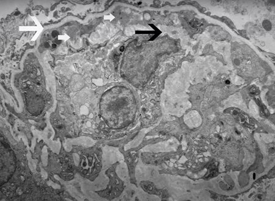
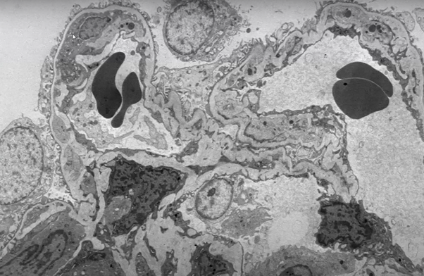
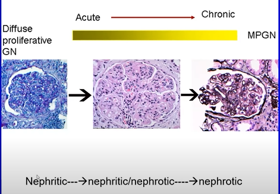

# MPGN

Chronic deposition of **debris** along the glomerular capillary walls which leads to inflammation.

MPGN is a pattern of injury – diverse aetiology

The deposits can be Ig, complement, fibrin

Glom responds to injury, tries to heal/wall off insult with addtional GBM, creates double contours / tram-trak

 

Very important to clarify is this is an Ig related disease (more treatable) vs C3G (complement dysregulation, more challenging treatment, worse outcomes)

 

# Histology

[Good Review](https://www.seminarsinnephrology.org/article/S0270-9295%2811%2900066-0/fulltext>)

**Light microscopy**

-   Two features – inflammation and healing
-   Inflammation is the “proliferative” phase – M**P**GN – Mesangial and endocapillary hypercellularity
-   Resolving/healing phase – **M**PGN - mesangial expansion with matrix and thickened capillary walls, cellular interposition with **double contour formation**

**Immunofluorescence**

-   Immunoglobulins, Kappa or Lamda light chains, C3

**Electron microscopy**

-   Mesangial deposits, capillary wall deposits (sub endothelial), cellular interposition and new basement membrane formation – ie. double contours

Small White arrows – sub endothelial deposits. Basement membrane is trying to “trap” the deposits as a reaction, just like an abscess being formed and walled off. Incoming cell inflammatory cells (monocytes) get “interposed”

More classic appearance here, note entire cell on the left is entrapped, and debris on the right. (images from the Glomcon episode of Sanjeev Sethi, MD, PhD Professor Department of Laboratory Medicine and Pathology Mayo Clinic Rochester, USA [Glomcon](https://www.youtube.com/watch?v=G6tvykyaF3w)

# Classification

Immunofluorescence/aetiological classification has replaced the older typing, is often much more informative than as allows more meaningful subdivision

](images/MPGN_classification_by_cause.jpg)

\~75% are down the left side typically and Ig associated. In the case of Ig positive on IF, then run through a list of differentials similar to this -

](images/immunoglobulin_pos_MPGN.png)

MPGN “traditional classification” - based on EM, disregarded IF.Not very useful, historical interest mostly. Confusing. Ignore.

**Primary**:

-   **Type 1** sub endothelial
-   **Type 2** AKA dense deposit disease - intramembranous
-   **Type 3** subendothelial, intramembranous and subepithelial

**Secondary:**

-   Infection, Hep C was classic

# MPGN Treatment

# MPGN Outcomes

[Best Review](https://www.nejm.org/doi/full/10.1056/nejmra1108178)

# C3G

-   All ages, no sex predilection

-   Nephritic -\> nephrotic presentation

-   Typically, present with HTN, proteinuria and haematuria

-   Bright C3, minimal or no Ig

-   2 flavours C3GN, DDD (EM)

-   Usually shows MPGN but other patterns possible e.g. “post infectious”

-   if coexisting IG, more likely to have an autoantibody rather than infection

-   C3GN When associated with infection

-   Some of these have very distant infections which might be associated with complement mutations or residual auto antibodies

# G3G Treatment

If associated with Ig/MRUS – clone directed treatment

Haematological remission gives best chance of good renal outcomes and evidence suggests good outcomes

<https://pubmed.ncbi.nlm.nih.gov/29759418/>

Excluding the monoclonal related disease then IS seems ineffective

<https://pubmed.ncbi.nlm.nih.gov/30077216/>

# C3G Outcomes

50% hit ESKD in 5 years

Usual suspects predict outcome: fibrosis, tubular atrophy, High presenting Cr, proteinuria \>3g/24 hours

