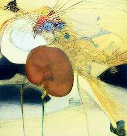

```{r setup, include=FALSE} 
library(rentrez)  # For fetching PubMed articles
library(DT)       # For interactive tables
library(dplyr)    # For data manipulation
library(httr) 
library(jsonlite)
library(rentrez)
library(reshape)
library(ggplot2)

```

### KHS Research Output

A note here on methodology

```{r, echo=FALSE}

search <- entrez_search(db = "pubmed",
                              term = "(kidney health service metro north) OR (Eoin O'Sullivan) OR (Eoin Daniel O'Sullivan) OR (0000-0002-7709-6595) OR (Monica Ng) OR (0000-0002-0431-9110)", retmax=5000)
multi_summs <- entrez_summary(db="pubmed", id=search$ids)
library(ggplot2)
search_year <- function(year, term){
    query <- paste(term, "AND (", year, "[PDAT])")
    entrez_search(db="pubmed", term=query, retmax=0)$count
}

year <- 2008:2025
papers <- sapply(year, search_year, term= "(kidney health service metro north) OR (Eoin O'Sullivan) OR (Eoin Daniel O'Sullivan) OR (0000-0002-7709-6595) OR (Monica Ng) OR (0000-0002-0431-9110)", USE.NAMES=FALSE)

data <- data.frame(year, papers)

# Create the ggplot
ggplot(data, aes(x = year, y = papers)) +
    geom_line() +                      
    geom_point() +                  
    ggtitle("KHS Research Output") +   
    xlab("Year") +                     
    ylab("Number of Papers") +         
    theme_bw()                        

```

### Journals

A note here on methodology


```{r, echo=FALSE,eval=T}


journals <- extract_from_esummary(multi_summs, "source")
journal_freq <- as.data.frame(table(journals, dnn="journal"), responseName="n.papers")

top_journals <- head(journal_freq[order(-journal_freq$n.papers), ], 20)
ggplot(top_journals, aes(reorder(journal, n.papers), n.papers)) + 
    geom_point(size=4) + 
    coord_flip() + 
   ylab("Number of papers") +
 scale_y_continuous(breaks = 1:20,minor_breaks = NULL)+
    scale_x_discrete("Journal") +
    theme_minimal() +
    ggtitle("Top 20 Most Frequent Journals, 2008-2025") 

```

### KHS Researcher

table here, with ORCID, google scholar etc. Alphabetical.

### Contraversial

Experimental only, will remove before live

```{r, echo=F,eval=T}
papers_by_year <- function(years, search_term){
    return(sapply(years, function(y) entrez_search(db="pubmed",term=search_term, mindate=y, maxdate=y, retmax=0)$count))
}
years <- 2008:2026
total_papers <- papers_by_year(years, "")
omics <- c("kidney health service metro north ","0000-0002-7709-6595","0000-0002-0431-9110")
trend_data <- sapply(omics, function(t) papers_by_year(years, t))
trend_props <- trend_data/total_papers

trend_df <- melt(data.frame(years, trend_props), id.vars="years")
p <- ggplot(trend_df, aes(years, value, colour=variable))
p + geom_line(size=1) + ylab("number of papers")

```

### KHS Abstracts/Posters 2024
placeholders, working on it. pdf an issue. links only?




