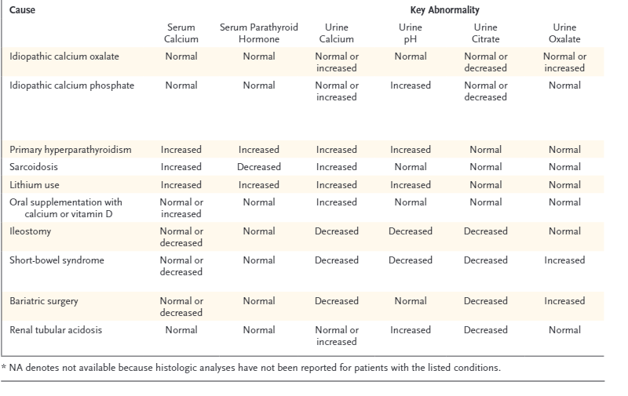

### Clinical Workup for Kidney Stones & Nephrocalcinosis

**Nephrocalcinosis: calcium phosphate in kidney, forms in alkaline urine**

-   Nephrocalcinosis refers to increased calcium deposition in the kidney, often in the form of calcium oxalate or calcium phosphate.
-   Some Pedants suggest reserving "nephrocalcinosis" for calcium phosphate deposits only, with calcium oxalate deposits termed oxalosis.
-   Can be found incidentally or associated with acute/chronic kidney injury.

**Etiology**

Nephrocalcinosis results from conditions causing hypercalcemia, hyperphosphatemia, hypercalciuria, hyperphosphaturia, and hyperoxaluria

### Common Causes & Associations

-   Primary Hyperparathyroidism: Seen in up to 22% of cases, with hypercalciuria overshadowing calcium reabsorption.
-   Sarcoidosis: Up to 50% of patients with renal involvement develop nephrocalcinosis.
-   Vitamin D Excess: Can lead to hypercalcemia and hypercalciuria, especially when combined with phosphate supplements.*
-   Distal Renal Tubular Acidosis: Most common cause of nephrocalcinosis from hypercalciuria without hypercalcemia.
-   Medullary Sponge Kidney: Up to 50% of cases show nephrocalcinosis.
-   Loop Diuretic Use: Prolonged high doses can lead to nephrocalcinosis.

### Hereditary Disorders

-   **Dent Disease:** X-linked condition associated with hypercalciuria, nephrocalcinosis, nephrolithiasis, and rickets.
-   **Hypophosphatemic Rickets:** Leads to nephrocalcinosis due to disturbances in phosphate handling.
-   **Hypercalciuria with Hypercalcemia:**
    -   Primary hyperparathyroidism
    -   Vitamin D therapy
    -   Sarcoidosis
    -   Milk-alkali syndrome
    -   Congenital hypothyroidism
-   **Hypercalciuria without Hypercalcemia:**
    -   Distal renal tubular acidosis (RTA)
    -   Medullary sponge kidney
    -   Loop diuretic use
    -   Inherited tubulopathies
    -   Chronic hypokalemia
    -   Beta-thalassemia
-   **Hyperphosphaturia with Hyperphosphatemia:**
    -   Tumor lysis syndrome
    -   Oal sodium phosphate bowel preparations
-   **Hyperphosphaturia without Hyperphosphatemia:**
    -   Inherited tubulopathies (e.g., Dent disease, Lowe syndrome)
    -   Hypophosphatemic rickets

### Medical History to Review

-   **Gastrointestinal Disorders**: Chronic diarrhoea (e.g., bowel disease), malabsorption, intestinal surgery, bariatric surgery
-   **Systemic Diseases**: Sarcoidosis, gout, renal tubular acidosis (RTA)
-   **Bone Diseases**: PTH-related disorders, idiopathic hypercalciuria, multiple myeloma
-   **Other Factors**: Immobilization (e.g., due to prolonged illness), hyperthyroidism, renal anomalies

### Metabolic Disorders to Consider

-   Primary hyperparathyroidism
-   Primary hyperoxaluria
-   Enteric hyperoxaluria
-   Cystinuria
-   Distal renal tubular acidosis (RTA)

### Medication Review

-   Topiramate
-   Calcium supplements
-   Carbonic anhydrase inhibitors
-   Alkali therapy
-   Vitamin D supplements

### Dietary Review

-   **Oxalate-rich foods**: Nuts, spinach, ascorbic acid
-   **Salt intake**: High salt can influence stone formation
-   **Eating disorders or unusual diets**: Assess dietary habits

### Family History

-   History of kidney stones or related metabolic conditions in the family.

### Imaging Studies

-   **Initial Evaluation**: Non-contrast CT scan is preferred.
-   **Follow-up**: Ultrasound is acceptable.

## Workup

### Blood Tests
-   **include**:
    -   Parathyroid hormone (PTH)
    -   Comprehensive Metabolic Panel (Chem20)
    -   ACE
    -   TFT
    -   Chem 20
    -   FBC
    
### 24-Hour Urine Collection

-   **When to collect**:
    -   At diagnosis and periodically during follow-up (e.g., every 6 months)
    -   Start with TWO samples : Aim for one collection on a workday and one on a non-working day.
    -   Ensure patients follow their usual daily diets during collection.
-   **Analytes to measure**:
    -  pH (using a pH meter, not dipsticks)
    -  calcium
    -  oxalate
    -  citrate
    -  uric acid
    -  Sodium
    -  potassium
    -  magnesium
    -  phosphate
    -  chloride
    -  sulfate
    -  ammonium
    -  creatinine
    -  urea
    -  cystine (test for cystine at least once)
-   **Stone Analysis**:
    -   Bring stone or fragments for analysis.
-   **Calculate Supersaturation**: For various stone-forming substances to guide treatment.

## SNP & QML Correspondance here re testing

## Management Strategies

**Dietary Recommendations**

-   **Urine output target**: 2-2.5 litres per day.
-   **Sodium**: Encourage a low-salt diet.
-   **Calcium**: Do not recommend avoidance of calcium; maintain normal intake.
-   **Oxalate**: Avoid high-oxalate foods such as spinach, rhubarb, wheat bran, chocolate, beets, miso, tahini, and most nuts.

A detailed list of oxalate content in foods is available [here](http://www.ohf.org) under "Resources."

Refer to Dietician

## Pharmacological Treatment

-   **Potassium Citrate (K Citrate)**: Urokit 2 tablets BD. For patients with low citrate levels (hypocitraturia) - careful with Calphos stones, can worsen
-   **Thiazides**:
    -   Chlorthalidone: 25mg po od ( 2 packs/100units/1 repeat)
    -   Hydrochlorothiazide (HCTZ): 25mg bd od ( 2/200/1)
    -
-   **Allopurinol** 300mg po od when urate stones

## NOSTONE Trial

 

[NOSTONE](<https://www.nejm.org/doi/full/10.1056/NEJMoa2209275>)

-   416 patients randomised for 2.9 years

-   inclusion: calcium-containing kidney stones 

-   Intervention:e hydrochlorothiazide at a dose of 12.5 mg, 25 mg, or 50 mg once daily or placebo once daily.  

-   Primary outcome: a composite of symptomatic or radiologic recurrence of kidney stones

-   Secondary outcome: radiological recurrance

-   Results:

-   A primary end-point event occurred in 60 of 102 patients (59%) in the placebo group, in 62 of 105 patients (59%) in the 12.5-mg hydrochlorothiazide group (rate ratio vs. placebo, 1.33; 95% confidence interval [CI], 0.92 to 1.93), in 61 of 108 patients (56%) in the 25-mg group (rate ratio, 1.24; 95% CI, 0.86 to 1.79), and in 49 of 101 patients (49%) in the 50-mg group (rate ratio, 0.92; 95% CI, 0.63 to 1.36).

-  lower radiologic recurrence at higher doses

-   There was no relation between the hydrochlorothiazide dose and the occurrence of a primary end-point event (P=0.66

- thoughts: critics suggest too low a dose, and note high urinary [Na] pre and post, suggesting poor diet. White, High salt, normal citrate and no RTA - can this be generalised?

 

### Specific Stone Considerations

-   **Calcium Phosphate Stones**: Be cautious with potassium citrate, as it may raise urine pH and worsen calcium phosphate stone formation.

**Follow-Up**

-   **Routine Monitoring**: Follow-up urine collections every 6 months to monitor stone recurrence risk and adjust treatment as needed.

**urine changes** 

[Source](<https://www.nejm.org/doi/full/10.1056/NEJMcp1001011>)

## lithorisk or similar calc here

## Patient info here

