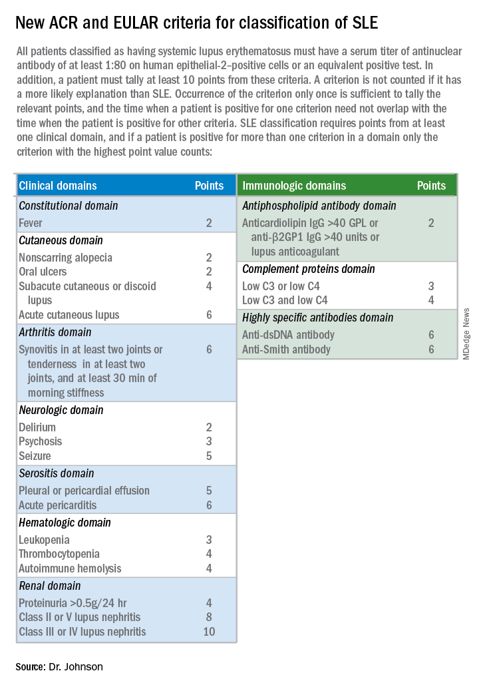
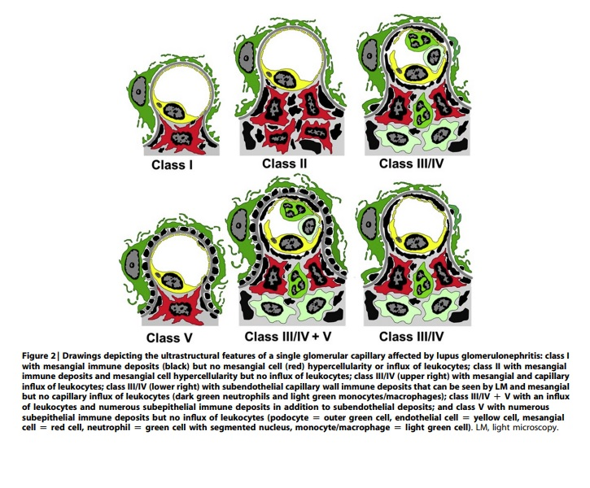
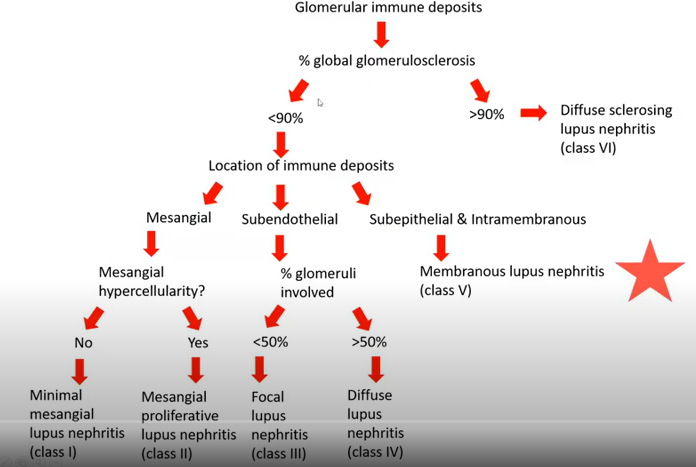
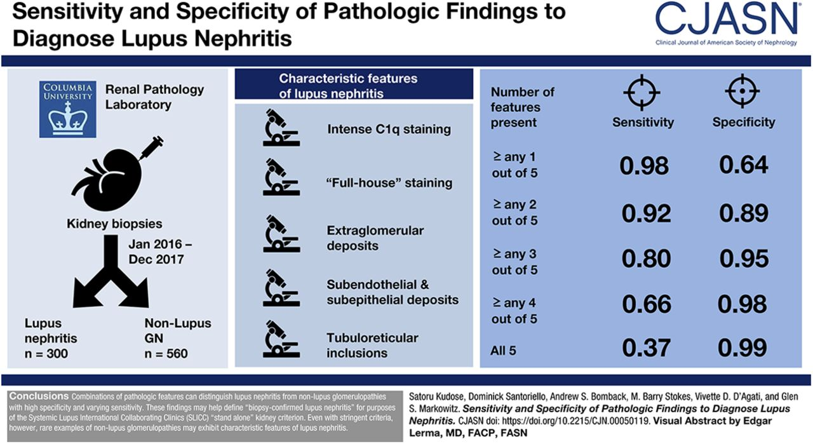
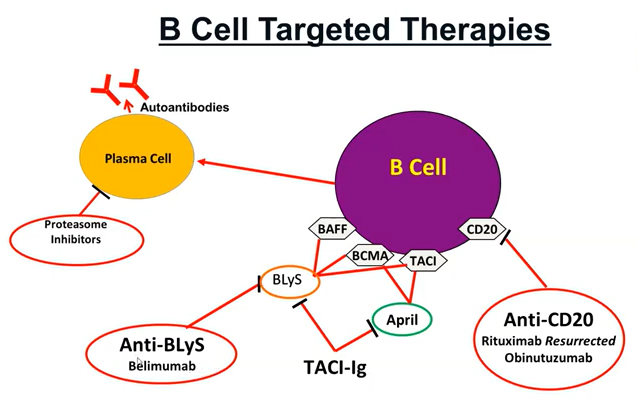

# SLE

-   Up to 60% of SLE patients have lupus nephritis
-   the female-to-male ratio is highest at reproductive age, ranging between 8:1 and 15:1
-   Black and Hispanic SLE patients develop LN earlier and have worse outcomes than white patients with SLE, including death and ESRD 

-   SLICC criteria for diagnosis of SLE = 10 point and positive ANA

-   Proliferative lupus nephritis = 10 points! Membranous = 8 so one other thing will get you there

Extra Renal Manifestation
-   Malar Rash
-   Alopecia
-   Arthralgia
-   Fatigue
-   Thrombocytopaenia
-   Haemolytic anaemia
-   more rare : Cardiomyopathy, cerebritis

# Lupus Nephritis

-   Haematuria and proteinuria, AKI/Flare - > CKD
-Most patients with SLE who develop LN do so within 5 years of an SLE diagnosis and, in many cases, LN is the presenting manifestation resulting in the diagnosis of SLE
-Within 10 years of an initial SLE diagnosis, 5–20% of patients with LN develop end-stage kidney disease
-   Be Suss: Young women with an ANA or proliferative GN
-   Almost always have full house staining (although not 100%)
-   Remember that LN classification are not diagnostic guidelines i.e. you can fulfil criteria but not actually LN

-   In LN patients with two risk alleles for APOL1 the odds ratio (OR) for ESRD was 2.72 (95% confidence interval [95% CI], 1.76 to 4.19; P<6.2×10−6). 

-   An HLA-DR2 subtype (HLA-DRB181503), characteristic of black populations, was linked to worsening proteinuria

-   Patients with LN also have a higher standardized mortality ratio (6–6.8 versus 2.4) and die earlier than SLE patients without LN

-   10-year survival improves from 46% to 95% if disease remission can be achieved 

-   Extra renal manifestations usually become quiestcent after ESRD onset @ ~6-12 months of RRT.

### Serology

-   **ANA**  = very sensitive, non specific
-   **dsDNA & anti-Smith** = less sensitive but more specific
-   **C3,C4** = Can be useful for dx and tracking flares. also low in skin manifestations and haemolytic anaemia
-   **Anti-histone** = Suggests drug induced lupus which very rarely affects kidneys
-   **Anti Ro/La** = Sjogrens, associated with neonatal heart block
-   **Anti-RNP** = assoc with lupus cerebritis
-   **Anti phopholipid ab**  = anti cardiolipin, lupus anti coagulant or b2 glycoportein 1 = TMA associations

#### APL syndrome

-   repeated VTE / miscarriages & **Strongly** + tests - weak + is a common false + (infection)
  -   aka hughes syndrome and lupus anticoagulant
  -   misnomer 1: lupus anticoagulant + doesnt mean you have lupus - about 50% of APL patients have SLE
  -   misnomer 2: anticoagulant effect is an in vitro phenomon, in vivo youre pro thrombotic

### Pathopysiology

-   Auto-Immune deposits in kidney, unclear aeitiology - theories include:
-   Apoptotic cells release DNA/nucelosomes -> antibodies form and create complexes -> inflammatory cytokines
-   "planted antigen" - anti dsDNA ab reacts with DNA/nucleosome (neg charged) trapped in GBM (pos charge)
-   Cross reactivity between kidney antigens and anti dsDNA : a-actinin, laminin, heparin sulphate

Full house – several variables: usage of frozen vs paraffin / scale of intensity / note the location of the staining - highly variable

One definition – concurrent + IgA,G,M,C4,C1q, at  least 1+ in intensity and granular, along the capillary walls

## Classification

[Lupus classification - ISN 2018](https://www.kidney-international.org/article/S0085-2538(17)30859-1/fulltext)

-   15-40% can evolve from one form to another and in an non-sequential manner
-   I know this is a bit obvious, but full house is called full house because you have 3 of a kind and a pair.

## Disease activity 

Proliferative components result in poorer outcomes. Signs of proliferative : / activity & chronicity:

-   Endocapillary hypercellularity /neutrophil extravasation ( loops occluded)

-   Fibrinoid necrosis and crescent/fibrocellular formation are actie leasions and obviously bad

-   Hyaline thrombi, wire loops ( due to sub endothelial immune deposits)

Proposed modified NIH lupus nephritis activity and chronicity scoring system

| **Modified NIH activity index**   | **Definition**                                                                                   | **Score** |
|-----------------------------------|--------------------------------------------------------------------------------------------------|-----------|
| Endocapillary hypercellularity    | Endocapillary hypercellularity in \<25% (1+), 25%–50% (2+), or \>50% (3+) of glomeruli           | 0–3       |
| Neutrophils/karyorrhexis          | Neutrophils and/or karyorrhexis in \<25% (1+), 25%–50% (2+), or \>50% (3+) of glomeruli          | 0–3       |
| Fibrinoid necrosis                | Fibrinoid necrosis in \<25% (1+), 25%–50% (2+), or \>50% (3+) of glomeruli                       | (0–3) × 2 |
| Hyaline deposits                  | Wire loop lesions and/or hyaline thrombi in \<25% (1+), 25%–50% (2+), or \>50% (3+) of glomeruli | 0–3       |
| Cellular/fibrocellular crescents  | Cellular and/or fibrocellular crescents in \<25% (1+), 25%–50% (2+), or \>50% (3+) of glomeruli  | (0–3) × 2 |
| Interstitial Inflammation         | Interstitial leukocytes in \<25% (1+), 25%–50% (2+), or \>50% (3+) in the cortex                 | 0–3       |
| **Total**                         |                                                                                                  | **0–24**  |
| **Modified NIH chronicity index** | **Definition**                                                                                   | **Score** |
| Total glomerulosclerosis score    | Global and/or segmental sclerosis in \<25% (1+), 25%–50% (2+), or \>50% (3+) of glomeruli        | 0–3       |
| Fibrous crescents                 | Fibrous crescents in \<25% (1+), 25%–50% (2+), or \>50% (3+) of glomeruli                        | 0–3       |
| Tubular atrophy                   | Tubular atrophy in \<25% (1+), 25%–50% (2+), or \>50% (3+) of the cortical tubules               | 0–3       |
| Interstitial fibrosis             | Interstitial fibrosis in \<25% (1+), 25%–50% (2+), or \>50% (3+) in the cortex                   | 0–3       |
| **Total**                         |                                                                                                  | **0–12**  |

**NIH, National Institutes of Health.**

[via Tiffany Caza on Glomcon](https://www.youtube.com/watch?v=IFNHzim4RRo)

In the recent ISN revision te group decided that the term ‘’endocapillary proliferation’’ is a misnomer that should be abandoned and replaced by the term “endocapillary hypercellularity,” because most of the hypercellularity in glomerular capillaries in lupus nephritis is caused by influx of inflammatory cells rather than by actual cell proliferation

Future revisions to the classification may remove class VI and suggest approach to classify tubular and vascular lesions

Unclear value in even distinguising between class III and IV. Tricky business. 

## I - Minimal Mesangial LN

-   Normal Light microscopy
-   Only demonstrable on IF
-   Remember the easiest place for a complex to deposit is the mesangium as theres no GBM as a barrier, so its the logical first place to find early disease

## II - Mesangio proliferative

-   Now there are some LM findings
-   Four or more nuclei fully surrounded by matrix in the mesangial area not including the hilar region
-   Mesangial cells unhappy and reacting - increase in mesangial cells and matrix

## III - Focal Proliferative

-   20-35% of patients
-   focal global or segmental involvment ( i.e. invidiual gloms, either partially or wholly)
-   Proliferative GN - hypercellularity all types of cell, epithelial, endothelial, mesangial
-   Fibrinoid Necrosis and intracapillary thrombi
-   Wire loop lesions possible on LM ( sub endothelial deposits lead to homogenous thickening of cap walls)
 

## IV - Diffuse Proliferative

-   35-60%
-   ESRD risk  may be as high as 44% over 15 years
-   Also (hypercellularity) aka proliferative
-   Involvement now hits >50% of the glom
-   Bad prognosis
-   Crescents possible (lesion containing extracapillary hypercellularity and involving>10% the circumferance of bowmans capsule)
-   Cellular cresents are <25% fibrin
-   Wire loop lesions possible
-   As recently demonstrated in a meta-analysis by Haring et al. the clinical importance of distinguishing between segmental and global lesions in class IV as defined by the ISN/RPS classification system has been questioned.

## V - Membranous LN

-   10-15%

-   Membranous lupus (V) can occur concurrent with proliferative disease (III/IV)

-   If its \>50% sub epithelial electron dense deposits ( i.e. immunoglob complexs)

-   If its \<50% then its not called as a membranous component by pathologist

### Primary membranous and membranous lupus can often look very similar

-   Clues: full house IF ( i.e. 3 immunoglob heavy chains – IgG, IgA, IgM, C3, C1q,)

-   C1q is reasonably specific for auto immune

-   Tubular basement membrane (granular) are not present in primary membranous but present in lupus membranous

-   Often diffuse deposits by EM: Sub endo, epi and mesangial and tubuloreticular inclusions on the sub endothelial surface of GBM (interferon “footprints” – also seen in other interferon drive diseases such as covid and HIV)

-   IgG subclasses – would reveal reaction of multiple subtypes – primary is usually just IgG4 (and sometimes also with IgG1)

### Membranous Antibodies & Antigens

-   Unlike primary membranous, antigenic target in membranous lupus are unknown

-   3-5% will be PLA2R+

#### EXT1/EXT2

-   EXT1/2 associated with MN – Dragon fruit appearance on EM, younger (mean age 38) 80% female, associated with autoimmune disease – 80% had lupus in Mayo series ( in contrast to PLA2R which is 0.55%)

-   In Memb lupus in mayo – 33% were EXT1/2 +

-   EXT+ basically didn’t progress, despite proliferation! Minimal proteinuria with baseline however

-   Good prognosis! If find an EXT1/2 ensure investigated lupus ( ?treated - clarify)

-   Stain for EXT1 or 2 (both not required) in PLA2r neg and autoimmune ( arkana suggestion)

-   ?whats the antibody

#### NCAM1

-   NCAM1 associated with Membranous lupus

-   Can have concurrent proliferative component ( 25% overall)

-   NCAM1 is up in CSF post seizures and reactive astrocytes – link to neuropsychiatric lupus? - speculative

-   In arkana series (n=20), mean age 34, 40% had neuropsychiatric symptoms ( 9% in non NCAM1 +)

-   ? circulating ? on podocytes. Antibody titres unclear value

-   cohort: Normal function, 6.7 g/protein/day

-   Frequency: arkana looked at 220 cases of memb lupus = 6.6% +, MAYO looked at idiopathic MN 1-2%

#### TGFBR3

-   TGFBR3 associated with membranous lupus

-   Arkana cohort ( n=17)

-   50% proliferative component

-   16/17 Female, 8.4g/proteinuria day , 13/17 lupus

-   Expressed on podocytes - ? whats the antibody

#### CNTN1

-   CNTN1 associated MN – Chronic inflammatory demyelinating polyneuropathy. Contactin 1

-   IgG4 dominant ( odd )

-   1500 patients with CIDP/acute polyneuritis – older males (67, 10:1 m). 11 antibodies – 5 developed MN (?ref - mayo?)

## VI - Advanced Sclerosing LN

-   over 90% fibrosis
-   End stage disease
-   Rarely seen, may be scrubbed in next revision of ISN classification

## Non immune complex GN

-   Anti Phospholipid ab associated
  -   thrombotic microangiopathy 24% - can be renal limited
  -   Renal artery/vein thrombosis with infarction
  -   HTN
  -   Livedo reticularis
-   Necrotising ANCA+ GN ( pauci immune GN in SLE patients, pANCA and MPO+)
-   TIN - watch for hyper and hyperkalaemia. quite rare, especially in isolation.
-   lupus podocytopathy (defined as nephrotic syndrome in SLE that on kidney biopsy shows diffuse foot process effacement and no subendothelial or subepithelial immune deposits) 1.3% . Can lie along the MCD/FSGS spectrum
-   hydoxycholoroquine induced - rare - proteinuria and CKD, Biopsy reveals cytoplasmic inclusions within the podocytes, like Fabrys.

# Treatment

#### Notes

-   It may be time to move away from thinking of induction/maintenance and acknowledge the continuous nature of the disease (per [Rovin @ Glomcon](https://www.youtube.com/watch?v=E4oFaqTKnDk&t=938s))
-   Lupus has underlying and ongoing autoimmune processes that periodically erupt into clinical flares
-   Needs long term attenuation long term to prevent flares and CKD
-   Probably multi targeted B cells,T cells ,DC and cytokine
-   When flare occurs – needs acute inflammation stopped rapidly to stop scarring
-   Intermittent therapy bursts are needed to attenuate inflammation
-   Currently best acute therapy is IV pulse corticosteroids be we need to eliminate these due to toxicities

### Based on ISN classification

-   Class 2 generally do not need specific therapy for their kidney disease but may need immunosuppressive treatment for extrarenal SLE manifestations. 

-   Patients with mainly chronic injury (any class) or end stage damage (class 6) also do not need immunosuppression for LN, but may benefit from antiproteinuric, renoprotective measures. 

-   The proliferative classes (3 and 4) are often treated with potent immunosuppression, whereas nonproliferative

-   membranous LN (class 5) may be managed conservatively (antiproteinuric therapy) if patients have subnephrotic proteinuria, or with immunosuppression if patients have nephrotic range proteinuria.

[Excellent CJASN overview](https://cjasn.asnjournals.org/content/12/5/825#sec-6)

**Natural history with standard of care based on complete renal remission in placebo arms of notable trial**

-   LUNAR 28.5% (multi-ethnic)
-   ELNT aka Eurolupus 40% (Caucasian)
-   Dutch working Party on SLE 32.5% (Caucasian)
-   BMS(CTLA4Ig) aka abatacept 15% (multi-ethnic)

## Antimalarials

A good idea for most lupus patients

-   6mg/kg hydroxychloroquine
-   Gladel et al - OR 0.38 for developing LN in SLE if on anti malarial.
-   Relesser et al - OR 0.58 for developing LN in SLE if on anti malarial, Developing ERSD 0.23, complete response 1.61
-   Eye toxicity – annual dilated eye examination

## Induction

Severe proliferative

**Methylpred:** 0.5-1g/kg for 1-3 days, then oral pred 1mg/kg/day (ideal body weight) max 80mg taper over weeks

Plus **CYC or MMF**

-   **MMF 2-3g/day for 6 months**
-   **IV CYC 500mg fortnightly for 3 months - 3 g total (Eurolupus)**
-   IV CYC 0.5-1g/m2 q monthly \* 6 (NIH protocol)
-   PO CYC 1-1.5mg/kg/d, max 150mg/d for 2-4 months

Eurolupus

-   Low dose vs NIH regime
-   Follow up (5 years and 14 years)
-   Equally well free of Renal flare/ ESRD

Criticism:

-   mostly white northern European patients (however trials from SE asia and abatacept trial had all patients on Eurolupus trial and no different was observed suggesting this ethnicity isn’t a concern)
-   MMF ( Dooley NEJM 2011) – suggests that MMF induction may be inferior to CYC induction – slightly higher treatment failure ( but non statistically significant)

## Maintenance

Pred taper down to 5-10mg /day

-   **MMF 1-2g/day (first choice)**
-   AZA 1-2.5mg/kg/d (pregnancy / intolerant of MMF)
-   CSA 2.5mg/kg/d/TAC (trough 4-6) if MMF/AZA not tolerated

ALMS maintenance trial NEJM 2011

Time to treatment failure \| n=227 \| MMF vs AZA \| European mild-mod disease

Maintain nephritis ANN Rheum disease 2010

Time to renal flare \| n= \| MMF vs AZA \|

## Emerging therapies

### Bortezomib

**Bortezomib – proteosome inhibitor**

-   Auto ab are made by plasma cells/ blasts
-   As b cell lineage mature, it loses its CD20 molecule thus arnt targeted by rituximab
-   PI blocks NK-kb activation – remembering hat NK-kB is a bit of a master pro inflammatory regulator
-   Decreased type 1 IFN activity
-   Decreased Dendritic cells
-   Peripheral nervous system off target side effects
-   Not currently being trialed in LN, bother other PI are

Tobias el al Ann rheum disease 2015

-   12 refractory LN patients, 8 with class IV LN, pathogenic ( and vaccine!) ab reduced, drop in SLEDAI ( activity scale)
-   C3 improved, Proteinuria declined

### Obinutuzumab

Humanized type II anti-CD 20 ( ritux is a type 1 anti CD20)

Approved for CLL and follicular lymphoma

Vs ritux it has 100x ab-dependent cytotoxicity, greater cell death, reduced internalization, less reliance on complement dependent cytotoxicity

Superior B cell depletion in patients with RA

Nobility trial – phase 2

-   2 years \| n=126 \| Obinutuzumab & MMF vs placebo & MMF
-   \~ half were dsDNA + , 10% black \| CRR 35 vs 23 ( 1 year) and 40 vs 18% at week 76
-   Complete response rate increases over time
-   Much earlier and almost complete b cell depletion vs ritux ( in historical LUNAR data – ritux peaks around week 12 at 87% and has declined by week 24 to 52%)
-   SAE 23 s 30%, infection 6 vs 18%, 1 vs 4 death.

### Belimumab 

Belimumab is approved in USA for non renal lupus

Antibody vs BLys ( survival factor for b cells)

ITN calibrate – phase 2, open label proliferative LN – steroids + cyc (750) + ritux week 0,2 and placebo or belimumam at week 4 – Didn’t suggest any additional benefit

Why? Killing b cells increased serum BLys

Reconsistuion of b cells in high BLyS environment fosters auto reactive B cells

Thus anti BLyS treatment may help sustain a response and prevent reconsistution

TBC – BLISS LN will be out shortly

### Multitargeted therapy

Lower dose of steroids & MMF & CNI

Usually Chinese studies

Voclosporin phase 2 multi target trial ( novel calineurin inhibitor) – added to 2g/day MMF and rapid taper of steroids - down to 2.5mg by week 16 – pretty aggressive taper

Outcomes: low dose was more effective – but disproportionate death in the low dose group

### Misc comments on treatment 

Anti CD20 therapy also affect T cells, Drops T regs,

# Pregnancy

SLE often develops or Flares during pregnanacy or first 8 weeks post partum. 
Can mimic preeclampsia/HELLP

# Idiopathic full house GN

[Ingeborg Bajema @ Leiden](https://www.youtube.com/watch?v=thv1tCKDOWM)

*Aka Non-lupus full house nephritis, Lupus-like nephritis, a frome fruste of lupus nephritis, renal limited lupus nephritis.*

-   Is this LN? Renal limited LN? How do we recognize it?

-   Usually a bx turns up with full house and “consistent” ( could be anything) pictures in a patient with no clinical suspicion of SLE

-   It could of course be that this is the first finding of LN/SLE

Bajema et al (NDT 2017) | N= 149 LN -\> 32 non-lupus full house -\>20 idiopathic/12 atypical variants \| Poor renal outcomes \| Non developed SLE \|

Other case reports of idiopathic full house GN:

-   Membranous due to syphilis (BMJ 2021)

-   Drug induced (CJASN 2015)

-   Infection related (Clin Nephrology 2020)

-   Herbal Medication (BMC 2020)

-   HIV (Kidney Int 2005) – 13/17 endo cap hypercellularity, memb in 1

-   Can occur post tx

Rarely can proceed SLE by several years, in paediatric patients usually tbh

Tubulo-reticular inclusions by EM are useful to differentiate and identify true lupus (TR inclusions no exclusive to LN)

Check for cryoglobs (especially if MPGN) - of course you can get cryoglobs with LN

?Might be sensible to treat severe looking histology as a severe LN in the absence of reversible causes/infections - careful with diagnostic anchoring to avoid accidently immunosuppression if infection is a cause

Follow up closely

# Repeat Renal Biopsy

-   After completing 6–8 months of immunosuppressive therapy, 20%–50% of complete clinical renal responders still had histologic evidence of ongoing active inflammation, and 40%–60% of patients with no histologic evidence of disease activity still had persistent, high-grade proteinuria
-   Even after several years of immunosuppressive treatment, histologic activity was found in about 20% of patients who had been in sustained clinical remission. 
-   Conversely, 40% of patients in complete histologic remission after long-term treatment had persistent clinical findings
- probably most useful for patients with class 2 or 5 with a Flare as this could suggest proliferative disease thus intensification of immunosuppresion

### NIH disease activty scores as prognosis:
10 years of follow-up, the probability of doubling serum creatinine was about 56% for patients whose second biopsy had persistent activity (an activity index >2), compared with 20% for patients who had an activity index ≤2 (P<0.001). Similarly, 10-year renal survival was >90% if the chronicity index of the repeat biopsy was <3, but 55% if the chronicity index was >6 (P=0.10).

