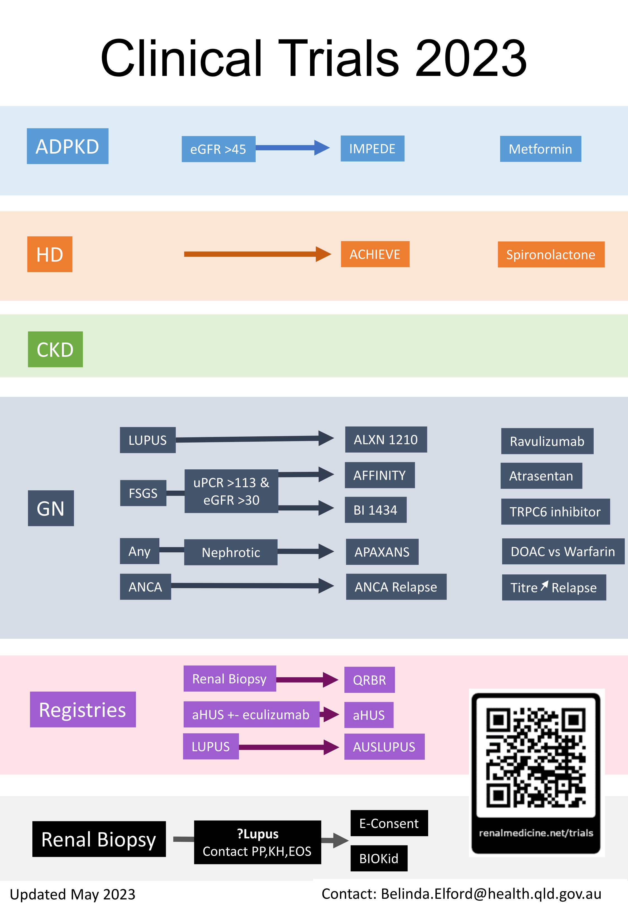

#### Contact research nurses for screening & enrolment

 

# ADPKD

 

## IMPEDE

Metformin vs Placebo for patients with ADPKD

**Inclusion Criteria**

- eGFR >45
- Can be on tolvaptan

 

# HD

 

## PHOSPHATE

 

Phosphate targets of <= 1.5 vs 2-2.5 in patients on HD

**Inclusion Criteria**

-   on HD \>= 3/12
-   \>45 yo
-   \>18 if DM
-   on a phosphate binder

 

## ACHEIVE

Spiro vs Placebo in patients on HD

**Inclusion Criteria**

-   on HD or PD \>= 3/12
-   \>45 yo
-   \>18 if DM
-   Exluded if K+ \>5.8

 

# CKD

 

# GN - LUPUS
 

## ALXN 1210

**A Phase 2, Double-Blind, Randomized, Placebo-Controlled Study to Evaluate the Efficacy and Safety of Ravulizumab in Adult Participants With Proliferative Lupus Nephritis (LN) or Immunoglobulin A Nephropathy completed (IgAN)**

-   **Ravulizumab** is a humanized monoclonal antibody which inhibits complement component 5
-   Similar to eculizumab but much longer acting
-   PBS approved for PNH
-   There is substantial interest in the role of complement pathway in lupus nephritis

**Inclusion Criteria**

-   Age between 18 and 75
-   Body weight \>40kg
-   Must be vaccinated or agree to be vaccinated against Meningococcal infection, Haemophilus influenza type b and Streptococcus pneumoniae prior to randomization.
-   Participants on SGLT-2 inhibitors must be on a stable dose 12 weeks prior to screening
-   Kidney biopsy diagnosed class III or class IV LN within 6mths of screening or during screening
-   Clinical diagnosis of SLE
-   Proteinuria with UPCR ≥ 1g/g

 

# GN - FSGS

 

## AFFINITY

A Phase 2, Open-Label, Basket Study of Atrasentan in Patients with Proteinuric Glomerular Diseases

The Phase 2 AFFINITY study will assess the efficacy and safety of atrasentan in patients with proteinuric glomerular diseases at risk of progressive kidney function loss.

Cohort 2 – FSGS

**Inclusion Criteria**

-   Biopsy confirmed FSGS
-   UPCR\>1.5g/g
-   eGFR ≥ 30mL/min/1.73m2
-   Receiving RAS inhibitor stable for 12 weeks pre screening
-   If receiving systemic corticosteriods or calcineurin inhibitors, dose must be stable for 12 weeks pre screening
-   BMI \< 40 Kg/m2

 

## BI 1434

A multicentre, randomized, double-blind, parallel group, placebo controlled study to assess safety, tolerability, pharmacokinetics and pharmacodynamics of BI 764198 administered orally once daily for 12 weeks in patients with focal segmental glomerulosclerosis.

BI 764198 is a potent inhibitor of human TRPC6

**Inclusion Criteria**

-   18 – 75 and able to sign Informed Consent
-   Biopsy Proven FSGS or documented TRPC6 mutation
-   UPCR ≥ 1000mg/g
-   Completion of initial corticosteroid therapy (if applicable).
-   Patients treated with corticosteroids must be on a stable dose for at least 4 weeks prior to
-   screening visit with no plan to change the dose until end of trial treatment.
-   Pt’s treated with ACE inhibitors, ARBs, finerenone, aldosterone inhibitors, or SGLT2 inhibitors should be on a stable dose for \>4 weeks before screening visit with no plan to change the dose until the end of trial treatment.

 

# GN - IGAN

 

## ALIGN

A Phase 3, Randomized, Double-blind, Placebo-controlled Study of Atrasentan in Patients with IgA Nephropathy at Risk of Progressive Loss of Renal Function

-   Atrasentan is a potent endothelin receptor antagonist
-   Demonstrated to reduce composite renal outcome (doubling of creatinine or ESRF) in diabetic nephropathy (SONAR study 2019)
-   Major side effects are fluid retention/heart failure

**Inclusion Criteria**

-   18 and able sign Informed Consent
-   Biopsy Proven Primary IgAN
-   3\. Receiving stable dose of RAS Inhibitor for 12 weeks
-   Total Urine Protein ≥1 g/day
-   eGFR ≥ 30

 

# GN - NEPHROTIC SYN

 

## APAXANS

This study will evaluate primarily the pharmacokinetics and safety and efficacy of apixaban as a preventative for venous thromboembolism in patients with nephrotic syndrome as compared to warfarin

**Inclusion Criteria**

-   All adult patients with nephrotic syndrome with serum albumin \<25g/L (*for prevention of nephrotic syndrome related thrombotic disease*)
-   Minimum age: 18 years /Maximum age: No Limit/Gender: both male and female

**Exclusion Criteria**

-   eGFR of less than 25mL/min /Patients requiring any form of dialysis
-   Abnormal liver dysfunction {defined as chronic Liver Disease (Child-Pugh score of B or C cirrhosis) or biochemical evidence of significant hepatic derangement (bilirubin 2-3 times the upper limit of normal, in association with aspartate transaminase (AST) or alkaline phosphatase (ALP) levels 3 times the upper limit normal).}
-   Known hereditary or acquired bleeding disorders
-   Antiphospholipid syndrome
-   Haemoglobin (Hb) \<90g/L/ Platelets \<100,000/ul

 

# GN - ANCA

 

## ANCA Relapse

**Inclusion Criteria**

Existing and new patients with confirmed ANCA + ve vasculitis attending follow-up for ongoing monitoring
 

# Registries

**Three registries are ongoing.**

-   QRBR – Inclusion criteria: patients undergoing renal biopsy
-   aHUS Registry- Inclusion criteria- Patients diagnosed to have aHUS (received/receiving Eculizumab)
-   AUSLUPUS Registry- Inclusion criteria – Patients diagnosed to have SLE/Lupus Nephritis

# Previous Trials recruited in KHS 

Data collected from 2023 onwards

## FALCON

Bardoxylone vs Placebo for patients with ADPKD

**Recruitment stopped Q1 2023**

## AFFINITY

A Phase 2, Open-Label, Basket Study of Atrasentan in Patients with Proteinuric Glomerular Diseases

**Recruitment stopped Q1 2023**

