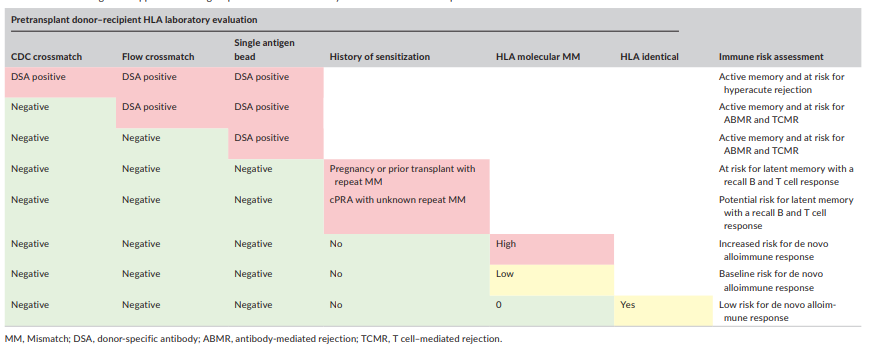
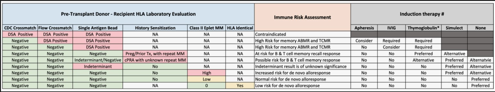

# Assorted Tx notes - for catagorisation later

## HEP C Donor kidney

Recipients of kidney transplants from HCV-RNA–positive deceased donors had 5-year mean allograft survival that was not statistically different from HCV-RNA–negative kidney recipients during the direct-acting antiviral era [JAMA 2022](https://jamanetwork.com/journals/jama/fullarticle/2795744)

## Highly sensitized patients

Source: Sensitization in Transplantation: Assessment of Risk (STAR). 2017 Working Group Meeting Report.

