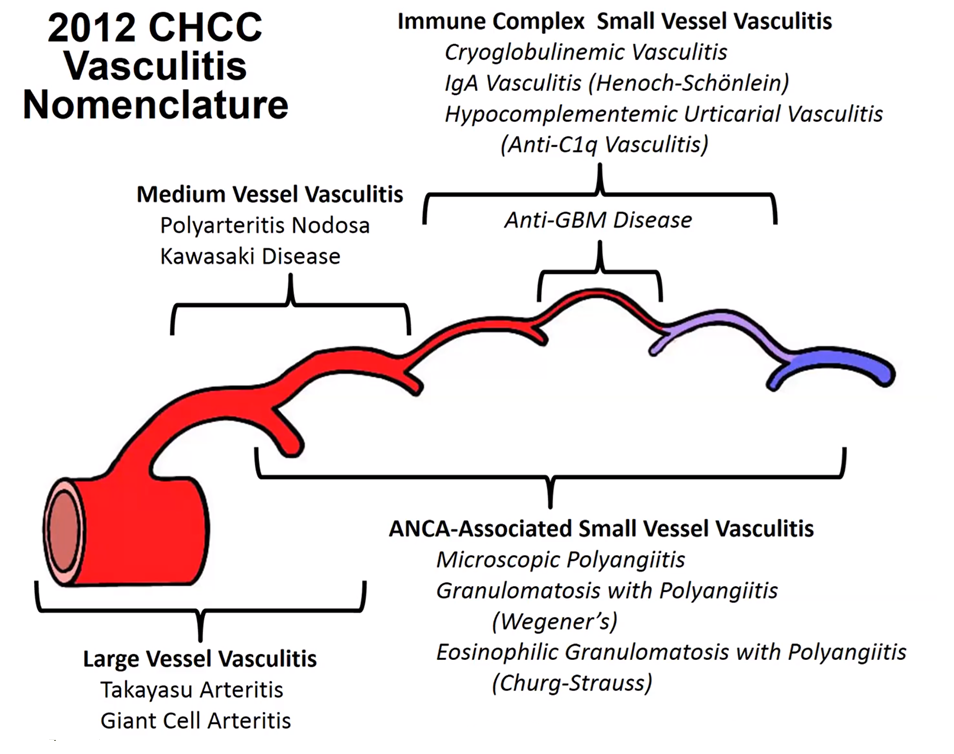
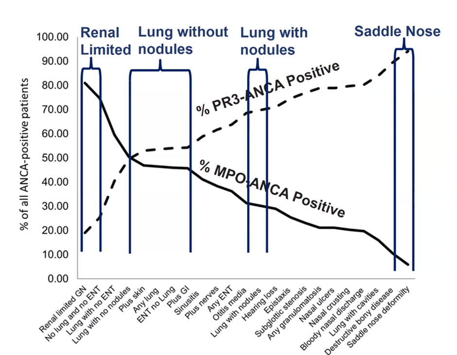
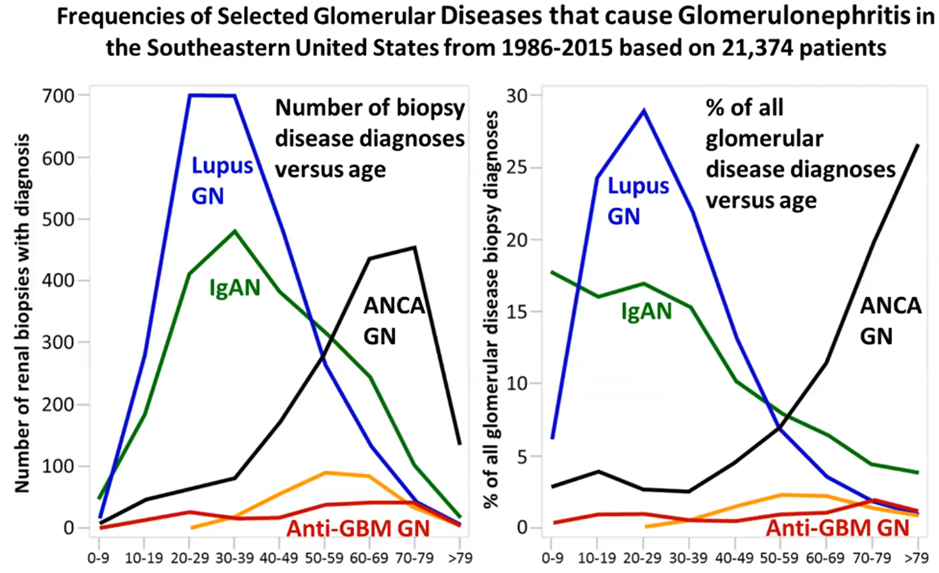
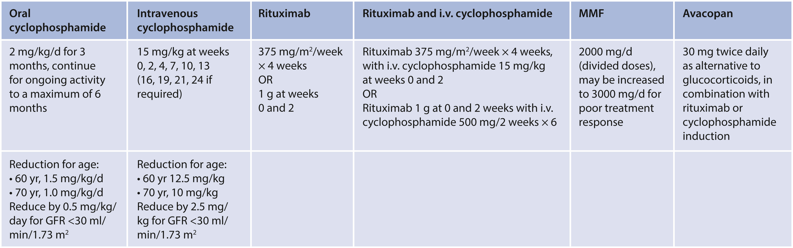
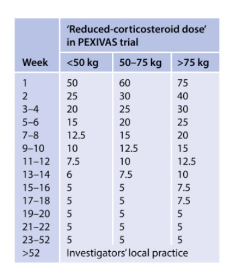

## Large Vessel

A vessel you can see grossly – e.g. Aorta, major branches

-   **Giant cell**
    -   Patient \>50
    -   Previously known as temporal arteritis – bad name – doesn’t always affect temporal arteries, and other vasculitis can affect Temporal arteries (e.g. GPA)
    -   Aortitis: Multinucleated giant cells, disrupts elastic fibres of internal elastic lamina.
    -   Can affect a Renal Artery – rare, very rarely causes renovascular HTN.
    -   Predilection for head and neck vessels
-   **Takayasu**
    -   Patient \<50 (at time of onset)
    -   Often granulomatous – histopathology often fairly similar to Giant cell arteritis – no biomarkers currently, very challenging for path to tell apart.
    -   In contrast to GCA - Can often cause RAS and renovascular HTN
    -   Aortitis – transmural inflammation
-   Notes:
    -   Fibrinoid Necrosis absent or minimal
    -   Can’t really differentiate between Arteriosclerosis vs post vasculitis – silver stain can help show the sclerosis.

## Medium Vessel 

Main visceral e.g. mesenteric, renal arteries, arcuate

-   **Polyarteritis Nodosa**
    -   Necrotising arteritis of medium/small without GN or vasculitis in arterioles, capillaries, or venules
    -   Diagnosis of **exclusion** of Kawasaki and Small Vessel Vasculitis
    -   Therefore, must be ANCA negative (pathology indistinguishable)
-   **Kawasaki**
    -   Initial name was “infantile PAN” in USA
    -   Children \<3 & infants
    -   Mucocutaneous lymph node symptoms (erythema, mucosal sloughing, nodes up)
    -   Coronary predilection – MI major concern.
    -   Aorta and large arteries may be involved.
    -   Renal involvement less common a problem but often found on postmortem
-   Notes:
    -   Necrotizing Arteritis is primary lesion.
    -   Inflammatory aneurysm and stenoses are common.
    -   Early: fibrinoid necrosis – 1 weeks later – scar/fibrosis

## Small Vessel 

Microscopic vessels e.g. glomerular capillaries

## Pauci Immune: ANCA

-   ANCA activates neuts and mono directly via PR3/MPO- \> amplified by C3a, C5a (alternative complement)
-   Initial infiltration is neuts but replaced within a few days by monocytes and macs.
-   Pauci =/= absence, you can find a little bit if you look, especially on EM (e.g. microenvironment generation of complex?)
-   Can affect essentially **any** organ or tissue.
-   Best Practice: use a phenotype & serotype i.e. MPO-ANCA MPA, or PR3 ANCA MPA, ANCA-Negative GPA etc

### Phenotype

-   Microscopic Polyangiitis aka MPA
    -   No granulomas, no asthma
-   Wegener’s Granulomatosis aka GPA
    -   Granulomas, no Asthma
-   Churg-Strauss Syndrome
    -   Eosinophilia (\~10%), Asthma, Granulomas

### Serotype

**C-ANCA & P-ANCA**

Indirect immunofluorescence (IIF): microscopic technique, result is positive or negative with some descriptive qualifiers

-   C-ANCA is typically a diffuse fine granular labeling of the cytoplasm that is accentuated between the nuclear lobes
-   P-ANCA yields a finely rimmed, homogeneous fluorescence staining of the perinuclear cytoplasm. Labeling of the perinuclear cytoplasm by p-ANCA is actually an artefact of ethanol fixation, which causes a redistribution of the positively charged cytoplasmic granular proteins to collapse onto the surface of the negatively charged nucleus.

**Anti-MPO or Anti-PR3**

-   Enzyme-linked immunosorbent assay (ELISA): will confirm an antigenic target of the ANCA
-   Unclear the best diagnostic path – [some groups](https://pubmed.ncbi.nlm.nih.gov/27481830/) advocate using ELISA exclusively , others feels [ELISAS](https://www.ncbi.nlm.nih.gov/pmc/articles/PMC8478512/) are not yet suitable for screening due to the higher false neg rate (\~40% in this study case)

Phenotypes

-   C-ANCA are primarily present in sera from patients with Wegener's granulomatosis and mainly recognize proteinase 3.
-   P-ANCA are frequently detected in patients with microscopic polyangiitis and most often react with myeloperoxidase.

**False Positives are common**

-   ANCA in ulcerative colitis (UC; 60–87%), primary sclerosing cholangitis (PSC; 60–92%), autoimmune hepatitis (AIH; 50–96%) and, to a lesser extent, Crohn's disease (CD; 5–25%)
-   No cytoplasmic target yet identified in these GI cases - various proposed names atypical p-ANCA’, ‘a-ANCA’ or ‘x-ANCA’. There is likely a perinuclear target here, so perhaps atypical p-ANCA’, ‘a-ANCA’ or ‘perinuclear antineutrophil nuclear antibodies ([p-ANNA](https://www.ncbi.nlm.nih.gov/pmc/articles/PMC1906166/#:~:text=The%20staining%20patterns%20produced%20by,only%20label%20the%20perinuclear%20cytoplasm.))

| **Characteristic** | **RLV n=121** | **MPA n=264** | **GPA n=117** |
|--------------------|---------------|---------------|---------------|
| Diagnosis age      |               |               |               |
| Mean±SD            | 59.8±18.4     | 57.5±18.1     | 47.9±19.8     |
| Median (IQR)       | 66 (50, 73)   | 61 (49, 71)   | 50 (32, 64)   |
| MPO/PR3            |               |               |               |
| MPO                | 98 (81.0%)    | 155 (58.7%)   | 30 (25.6%)    |
| PR3                | 23 (19.0%)    | 109 (41.3%)   | 87 (74.4%)    |
| Kidney involvement | 121 (100%)    | 262 (99.2%)   | 105 (89.7%)   |
| Lung involvement   | 0 (0%)        | 157 (59.5%)   | 95 (81.2%)    |
| ENT involvement    | 0 (0%)        | 97 (36.7%)    | 88 (75.2%)    |

Source: <https://www.ncbi.nlm.nih.gov/pmc/articles/PMC5628710/>( adapted)

-   Notes:
    -   90% sensitive i.e. 10% of clinical phenotypes will be ANCA negative.
    -   Skin biopsies are useless, nonspecific leukocytoclastic.
    -   **Be alert for overlap** with both antiGBM and immune complex disease e.g MN, LN, IGAN – always test for ANCA and antiGBM together
    -   Consider the predilection for elderly but don’t miss the rare young ones.
    -   Dual positive MPO and PR3 – rare, consider drug induced e.g. Hydralazine.
    -   PR3 OR higher in Men, tend to be younger, higher eGFR
    -   OR of being PR3 increases from South to North i.e with decreasing [UV radiation](https://www.ncbi.nlm.nih.gov/pmc/articles/PMC6365766/)
    

## ANCA & anti GBM dual positive

Renal Outcomes more similar to Anti GBM

**Immune complex**

-   Anti GBM
    -   In situ immune complex formation
    -   Linear IF staining
    -   Highly restricted to small vessels
    -   **Never causes arteritis** – i.e. if you see arteritis in anti GBM disease its probably coexisting ANCA vasculitis.
-   IGA Vasculitis
    -   Systemic - IgA Dominant vessel wall deposits
    -   anti IgA1 may be relevant in future
-   Cryoglobulinaemic
    -   Cryoglobulins in blood and vessel
    -   Hypocomplementic
    -   High Rh factors can support
    -   Skin, gloms and peripheral nerves classic
-   Anti c1q (hypocomplementaemia urticarial vasculitis)
    -   Hypocomplementic
    -   Circulating anti C1q antibodies
    -   GN resembles lupus nephritis
    -   GN, uveitis and episcleritis are common

Variable: Cogans, Bechet’s

Single organ: Cutaneous small vessel vasculitis, primary CNS

Systemic disease : Rh, Lupus, Sarcoid

**Misc**

-   HBV – range of presentations – from PAN to Small vessel ANCA like
-   Drugs – dual positive classic

Infectious

-   Bacterial
-   Rickettsial (e.g. Rocky Mountain Spotted Fever – Dog tick, derm vasculitis, If+)
-   Viral
-   Fungal

## Treatment

Don’t wait for a biopsy to start treatment if unwell and convincing clinical picture

-   ANCA present in 90% of Pauci immune GN, and Bx has a diagnostic yield of about 90%
-   10% persistently ANCA negative,
-   Hunt for organ involvement – CT CAP, echo, full exam + further directed tests
-   Ensure no reason for false positive (NB: infection, Endocarditis etc)
-   Sclerosis is a poor prognostic sign
-   **Do not withhold** induction on the basis of unfavourable histology as recovery despite seemingly advanced disease is possible

## Initial induction

Image for regimes

**Glucocorticoids & Ritux/cylophos**

-   Cylcophos: RPGN, aggressive disease (pulmonary, neuro), Cr \>354
    -   [CYCLOPS](https://pubmed.ncbi.nlm.nih.gov/26621483/): IV=PO for remission, 50% less exposure, less leukopaenia, more relapse
-   Ritux: PR3 ([RAVE](https://pubmed.ncbi.nlm.nih.gov/26621483/), OR 2.11 for remission), children, frail older, sparing steroids, fertility concerns, bladder cancer. [RAVE](https://pubmed.ncbi.nlm.nih.gov/26621483/) excluded severe AKI \>350.
-   Combo: [RITUXIVAS](https://pubmed.ncbi.nlm.nih.gov/20647198/) – 375mg/m2 weekly \*4, CTX pulse 15mg/kg with ritux\#1 nd \#3 == 6/12 CTX & AZA
-   PEX: [MEPEX](https://pubmed.ncbi.nlm.nih.gov/17582159/) ( Cr\>500 ARR 6%), Consider for Cr \>300 (ARR 4.6%), requiring HD, pulmonary haemorrhage, GBM overlap. [PEXIVAS](https://pubmed.ncbi.nlm.nih.gov/30612116/) didn’t show benefit in eGFR \<50 or pul haem (and increased infections), [meta-analysis](https://www.bmj.com/content/376/bmj-2021-064604.abstract) suggests might still be worth it.

    Nonsevere disease only:

-   MMF: [MYCYC](https://pubmed.ncbi.nlm.nih.gov/30612116/) non life threatening, no RPGN, induction=CTX, much higher PR3 relapse.
-   MTX: non Renal disease, but high relapse
-   AVACOPAN: [ADVOCATE](https://pubmed.ncbi.nlm.nih.gov/33596356/) – non serious disease as pred alternative. Less SE, maybe a little better for albuminuria. Maybe.

**Never forget**

-   Pre induction check: TB (quantiferon gold), HIV, HBV, HCV, Strongloides
-   TMP-SMX for PJP
-   IgG levels baseline and 6monthly with ritux.

**Dose**

## Maintanence

**Remission:** (BVAS=0, stable or improved eGFR, may have persistent urine changes)

**Duration:** 18 months – 4 years. Options: Ritux vs Aza (MMF) & pred wean

Ritux

-   [MAINRITSAN](https://pubmed.ncbi.nlm.nih.gov/29695500/) (vs aza – less major relapses, not minor) – 500mg\*2 at remission, and 500mg at month 6, 12, 18.
-   [RITZAZREM](https://pubmed.ncbi.nlm.nih.gov/36958796/) (relapse, vs aza less major and minor) – 1g post induction, and month 4,8,12,16.
-   Can dose as fixed or by CD19 cells ( same relapse rates, lower overall doses)

Aza

-   1.5-2mg/kg/day at remission for 1 year, then drop by 25mg every 3 months.
-   1.5-2mg/kg/day for 18-24 months, then drop 1mg/kg/day for 4 years, then taper 25mg every 3 months. Pred 5-7.5 for 2 years then drop 1mg/2 months.
-   [AZA-ANCA](https://pubmed.ncbi.nlm.nih.gov/36958796/): 2 vs 4 years – relapse of 48 vs 24%
-   MMF if intolerant. ( 1g bd for 2 years)

If still on HD at 3 months – consider discontinuation if no manifestations

[PEXIVAS](https://pubmed.ncbi.nlm.nih.gov/30612116/) taper ( as effective as high dose, less SE):

## Relapse & Refractory

-   Relapse risk: GPA, PR3, ENT, multiple organs, history of relapse, residual ANCA positive, rise in ANCA, IS withdrawal.
-   Unclear risk – persistent haematuria? May lead to relapse
-   Return of haematuria when previously absent may indicate relapse
-   Ritux best for relapse ([RAVE](https://pubmed.ncbi.nlm.nih.gov/26621483/))
-   Refractory: try the ritux/cylo option not initially used. PEX if tricky.

## Tips

-   Tx: Remission for 6 months. ANCA persistence no barrier.
-   Relapse rate post tx 0.02-0.03 per patient year
-   50% have persistent haemato/proteinuria
-   Histological activity is unlikely in the absence of haematuria
-   5% GBM +
-   32% of GBM are ANCA +

### Post remission rising in ANCA

Per Stegeman on the ASN forums:

-   In general a significant rise in ANCA titer, either PR3 or MPO, over a period of 3-6 months is associated with a risk of relapse of around 60% in the 6-12 months following the ANCA rise. 
-   The other 40% will not have a relapse of disease over a period of 1-2  years. 
-   What a significant rise in ANCA is, is totally dependent on the test used (indirect immune fluorescent tests usually at least a fourfold rise (2 titer steps); ELISA based methods 75-100% increase and 2-3 times the upper limit of normal (so changes in the very low positive range usually mean not much) and should be analyzed for the test you are using to quantify ANCA levels. 
-   In our experience a continuous slow rise in ANCA (so less than a significant rise in 3-6 months or over a longer period) does not have much prognostic value above the baseline risk of ~10-20% annual risk of relapse associated with persistent positive PR3-ANCA in the first 5 years after diagnosis and initial treatment (for MPO-ANCA the risk seems lower probably more around 5-10%)

So I would advise not to treat an isoloated (significant!) rise in ANCA titer unless you want to minimize the risk of relapse to the absolute minimum (because you fear the consequences of the relapse for the patient, which seems not be the case for this particular patient (given the bothersome but not lifethreatening manifestations of her disease and the fact that most relapses copy the initial presentation and it is unusual (unfortunately not impossible) to have more extensive/severe disease manifestations during relapse as compared to the previous presentations).

