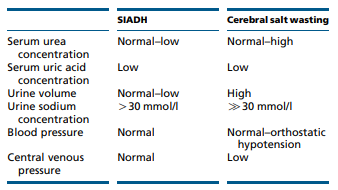

### Hyponatreamia

* Hyponatraemia is all about ADH typically
* Isothenuria normal in aging and in AKI/CKD.
  + Urine diulation is active and difficult 
  + Normal adult can generate dilute urine - 50mOSM/Kg
  + "Normal" diet is 10mOSM/kg/day, so 70kg male = (10*70)=700/50(daily limit)=14litres
  + Elderly limit ~150 mOSM/kg. Diet intake can be low (tea and toast) e.g. (3*50)/150=1Litre/day. free water over this limit dilutes urine.
  
* **Hypotonic** hyponatraemia requires treatment (probably), so confirm a pOSM if possible.
* k+ is oncotic too ( and can buffer NA) - 20mmol/KCL = 40ml 3% NaCL - may overcorrect if not aware!

* Urine Na: >30 mmol/l urinary Na = dry (NB low [Na] diet, diuretics, CKD - poor reabsorbtion (and impaired free water clearance too))
* Urine Osm: <100 mmmol/L = appropriately dilute. 100 - serum osm = grey area.
  + Remember that a **measured osm** also measures ineffective osmolues such as Urea or Ethanol - may be artefactually high and mask true hypoosmolar state
* Non-hypotonic (hyperglycaemia, mannitol, hypertonic radiocontrast,pseudohyponatreamia) - conservative Rx

### Correction

* Hypertonic Saline: 3% 150 mls/20 mins. recheck while giving second bag. target increase of 5mmol/L
* 0.9% Saline = 154mmol/L, 3% Saline =513mmol/L 
* 1ml/kg/hr 3% NaCL corrects Na ~ 1mmol/l/hr. e.g. 70mls/hr =1. so 150mls = ~2ish.
* **Speed limit:** 10/first 24 hrs, 8/24 hrs thereafter
* Fix overcorrection with a DDAVP clamp as below: 5% glucose and DDAVP 2/4mcg sc as below
* Once stable - give 3% saline as follows, remembering to substract bolus: 

6*([Totalbodywater](https://qxmd.com/calculate/calculator_344/total-body-water-watson-formula)+1)/(513-initial NA) = total volume - boluses already given.
Divide by hours (typically 4). HDU and monitor every 4-6

 

# Osmotic demyelination

Risks: Female, hypokalaemia, chronicity, alcoholism, cirrhosis, malnourishment.

# Pseudohyponatreamia

Triglycerides, cholesterol, or protein

# Hyperglycaemia correction of Na

This translates into adding 2.4 mmol/l to the
measured serum sodium concentration for every
5.5 mmol/l (100 mg/dl) incremental rise in serum glucose
concentration above a standard serum glucose concentration of 5.5 mmol/l (100 mg/dl).
(Ive seen this as 1.6mmol/L also)

# Free water clearance

Useful conceptually (in chronic state), not very quantitativly, and inconvienient outside ITU

**Calculation**

cH2O = uV - (uOsm x uV)/pOsm

 

where cH2O = Free Water Clearance

* where uV = Urine Volume per unit time ( make it a day I guess if 24 hours collection)
* where uOsm = Urine Osmolality
* where pOsm = plasma osmolality

**Interpretation**

Free Water Clearance positive

* Urine less concentrated than plasma
* Decreased Antidiuretic Hormone (ADH)
Free Water Clearance negative

* Urine is more concentrated than plasma
* Increased Antidiuretic Hormone (ADH)

# SIADH criteria

SIADH is pretty rare. Be suss.

* **Essential criteria**

* Effective serum osmolality >275 mOsm/kg
* Urine osmolality >100 mOsm/kg at some level of decreased
effective osmolality
* Clinical euvolaemia
* Urine sodium concentration >30 mmol/l with normal dietary
salt and water intake
* Absence of adrenal, thyroid, pituitary or renal insufficiency
* No recent use of diuretic agents

* **Supplemental criteria**
  + Serum uric acid >0.24 mmol/l (>4 mg/dl)
  + Serum urea >3.6 mmol/l (>21.6 mg/dl)
  + Failure to correct hyponatraemia after 0.9% saline infusion
  + Fractional sodium excretion >0.5%
  + Fractional urea excretion >55%
  + Fractional uric acid excretion >12%
  + Correction of hyponatraemia through fluid restriction

# Desmopressin aka DDAVP

**In DI:** 
If intravenous saline solution is administered and desmopressin is withheld at the same time, rapid changes in serum sodium levels may result, which puts the patient at risk for demyelinating lesions. 
 
* Opinion: In the management of desmopressin-associated hyponatremia with neurologic symptoms, the drug should not be withheld despite the presence of hyponatremia. Instead The medication should be continued while administering intravenous hypertonic saline solution. 

**DDAVP Clamp:**
Desmopressin is also used to minimize water excretion during the correction of hyponatremia during water diuresis. When treating hyponatremia, clinicians should monitor closely to avoid free-water diuresis. To prevent ongoing water losses in urine and overly rapid “autocorrection” of serum sodium level, desmopressin can be given to reduce free-water losses.

**Overcorrection Panic** HDU/ITU-> DDAVP, 2 micrograms IV q8hr & H20

**Clamp protocol:**

[Source: EMcrit](https://emcrit.org/pulmcrit/taking-control-of-severe-hyponatremia-with-ddavp/)

* DDAVP (2 micrograms IV q8hr) is started immediately and continued until the sodium is close to normal.
* Sodium is corrected by infusing hypertonic solutions, primarily 3% saline.  Of course, hypertonic bicarbonate.  For a patient requiring volume resuscitation, a large volume of normal saline could be used as well.
* The key point is that the sodium is increased by a direct effect of the infused solutions. This differs from approaches based on treatment of the underlying problem and waiting for the kidneys to excrete free water.
* Oral fluid intake **must** be restricted while on DDAVP.
* Potassium supplementation should be taken into account as this is osmotically equivalent to sodium (e.g. 40 mEq KCl tablet is roughly equivalent to ~80ml of 3% NaCl).
* Medications formulated in D5W should be avoided if possible, or otherwise taken into account (e.g. 100 ml of D5W will negate the effect of ~30ml of 3% NaCl)
* If volume overload occurs, this may be managed with furosemide.

**Contraindications to clamp**

* Psychogenic polydipsia/excessive water intake
* Hypervolemic hyponatremia (e.g. heart failure, cirrhosis)

**DDAVP dose:**

SC desmopressin at 2-4 mcg every 8-12 hours or intranasal desmopressin, 20 μg, every 12 hours

* The hourly urine output should decrease substantially in the first 1 to 2 hours after administration. 

* Urine osmolality should be checked to ensure that urine osmolality has increased; 500- to 600-mOsm/kg range = significant antiaquaretic effect.

### Vaptans

Not on European guidelines, no real well established role here. no RCT and hypernatreamia/osmotic demyelination risk. Avoid.

### Urea

Only in SIADH, ensure not volume deplete. A bit niche, most evidence from ITU.

*  oral intake of two to three doses of 30 g of urea over 24 hours or infusion of 80 g of urea as a 30% solution over six hours, water restriction (500 mL/24 hr), and sodium supplements (120 to 360 mmole/24 hr).
* generally safe and well tolerated
* osmotic diuretic & Salt load, so main risks are overcorrection / volume depletion

[58 patients at University of Pittsburgh Medical Center](https://cjasn.asnjournals.org/content/13/11/1627)

[42 patients in a Belgian ITU ](https://pubmed.ncbi.nlm.nih.gov/22647340/)

 

# Hypernatreamia

### Replace H20

[Free water deficit calculator](https://www.mdcalc.com/free-water-deficit-hypernatremia). Thats basically it. No such things as pseudohypernatreamia.

To excrete concentrated water ( i.e. not loose free water and push up your Na) a medullary concentration gradiant,ADH & responsive kidney (lithium/DI etc)

Intake: drinking the ocean, hypertonic saline, primary hyperaldo

If not thirsty  - hypothalamic lesion?

### DI & Polyuria

In patients with polyuria, diabetes insipidus is very unlikely if urine osmolality is >700 mOsmol/kg

nephrogenic - lithium, hypercalcamia hypoK, medullary cystic disease, sickle cell, ceongentical, post obstructive 

Central - trauma, surgery, invasive, booze

Give 2-4 mcg ddavp SC and monitor uOSM & vol every 30 mins for 2 hours. if Uosm increases = concentrating urine = responding = central. can be blunted due to chronic washout if longstanding ( and thus harder to coentrated due to loss of gradiant). should increment by 50% to outrule nephrogenic.

* Urine osm > 600 - concentrating ok, ?GI/other loss ? intake
* Urine osm  300-600 - partal DI. ol, CKD, post obstructive 
* Urine osm = pOSM (~300) - osmotic diuresis? NB Urea is actually an effective osm in urine ( cant make it past tubular epithelium) in contrast to in the body!
* Urine osm <pOSM - DI

# Cerebral Salt wasting

May have high urinary Cl-

 

# Guidelines & Protocols

[European Renal-Endocrine hyponatreamia guideline](https://eje.bioscientifica.com/view/journals/eje/170/3/G1.xml)

# Key Papers

 

[Nature Reviews Nephrology: DI](https://www.nature.com/articles/s41572-019-0103-2).
 

 

[Desalination](https://pubmed.ncbi.nlm.nih.gov/8992919/)
 

* 22 women post uncomplicated gyne surgery - given saline / Hartmans. s[Na] dropped in 21/22.
* Hyponatremia was generally caused by generation of electrolyte-free water during excretion of hypertonic urine-a desalination process. ADH at it again.

 

# Educational

links here

# Patient materials

links here

