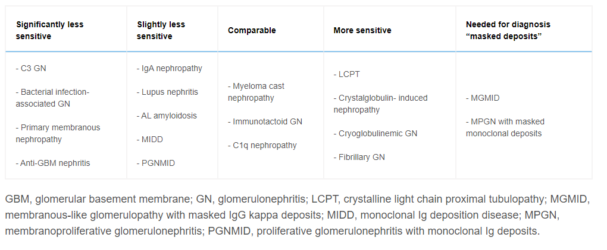

## Renal biopsy 101

These are notes from the Glomcon series, guiding through basics of [reading a renal biopsy](https://www.youtube.com/watch?v=E39aDH5gc-A). Ill expand over time with new sources.
 
Nice intro to renal path if youre new can be found [here](https://webpath.med.utah.edu/RENAHTML/RENALIDX.html) 

## The biopsy

The actual bx – need 16f needle minimum, get an arcuate artery to comment on endothelial disease is ideal
 
Minimum 10 gloms (arbitrary) number. Glom number is vital to exclude disease:
 

If you have a disease with 10% of gloms affected, you need 30 gloms to have a 95% chance to capture at least 1 glom!
 

## The cells of the glom

**Endothelial cells**

Nothing to say currently on this, but obviously very important - to be expanded

**GBM**

-   **GBM is a Gel**, things move through it weirdly. Mostly the GBM is made by the podocyte.
-   GBM has strong negative charge due to polyanionic proteoglycan-heparin sulphate
-   Repels negative molecules like albumin
-   Freely permeable below 2nm, impermeable above 4

**Podocyte**

-   Maintains structure of tuft
-   Makes GBM components
-   Foot processes are separated by 20-30nm filtration slits aka slit diaphragm– size selection if anything makes it past the GBM
-   **There is no naked GBM! If there is, this is bad!** Podocyte should cover it. Naked GBM (on EM) means high flux and leakage

**Mesangial cells**

-   Similar to vascular smooth muscle cells and pericytes
-   Can proliferate (in contrast to a podocyte which can’t)
-   Is embedded in its own matrix
-   Contractile, phagocytic, synthetic. Jack of all trades, multiple roles.
-   There is no GBM between the mesangial cells and the subendothelial space, so it’s much easier for cells to weasel their way up into the sub endothelial space. This is why subendothelial deposits generate a much brisker inflammatory response in contrast to sub epithelial (under the podocyte) – immune cells are better able to access them.
-   Antibodies can cross first and preferentially into the mesangial space, as there is no protective GBM. This is why lupus nephritis starts with mesangial deposition.

## Reading a biopsy

**Nomenclature**

Focal vs diffuse

Segmental vs global (globe = the whole glom, it’s a globe)

### Step 1 – Inflammation & Fibrosis

Start with inflammation and tubular fibrosis – chronic vs acute

Cells are identified by their location rather than any obvious features (e.g., nuclear changes are not super useful like they might be in general path). This can be confusing!

### Step 2 - Glomerulus

**Hypercellular?**

3 options – mesangial, endocapillary, extracapillary (aka crescents)

**Mesangial:**

-   \>= 4 cells per mesangial area. Read the peripheries, not the tufts/vascular pole (false +)
    -   cap loops are open here
-   PAS staining best here
-   Mild mesangial proliferation is fairly nonspecific and not useful

**Endocapillary**

-   Cap loops are full and absent! No sign of the little white capillary spaces!
-   Mixture of proliferation (endothelial) and often inflammatory infiltrate (mononuclear)
-   Can be segmental or global (some global will have a few odd lumen open)
-   Global endocapillary hypercellularity is immune complex GN under proven otherwise
-   Some nasty mesangial overlaps endocap and extends in there- gets called “endocap”

**Extra capillary aka crescents**

-   Crescent – extra capillary proliferation – acute glom damage
-   Presence of 2 or more cells in urinary space
-   GMB rupture – initiated by fibrin leaks into urinary space

**How to examine the GBM**

-   Too thin (EM only) or thickened? Only thickening can be seen on light (common lesion)
-   Homogenously, irregularly, +- double contours?

Thickened: only 3 options– diabetes, membranous, MPGN

**Diabetic glomerulosclerosis**

-   Earliest stages are homogenous GBM thickening, bit nonspecific
-   PAS stains the GBM, silver deposits silver salts onto silver stain (deposition technique – looks thicker but is super useful in membranous)

**Membranous**

-   Gets thicken because immune complexes get deposited in the sub epithelial space (i.e., between the foot process and the lamina densa (the lamina densa is the chewy type 4 collagen bit in the middle of the GBM). The GBM tries to grow up and around the deposits The spikes are from the lamina densa.

**MPGN (the injury pattern, not the dx category)**

-   AKA endocap hypercellular/proliferative, with variable mesangial expansion and infiltrating cells.
-   Take several weeks to develop – chronic pattern, theme is chronic endothelial injury.
-   Attacks endothelial cells chronically – tx glomerulopathy, TMA, circulating complexes that deposit underneath the endothelial cell which irritates it, and it tries to wall itself off so grows a new basement membrane to try to wall itself off from it.
-   Which leads with tram tracks aka double contours

**Other Capillary lesions**

-   Capillary collapse – missing lumens without hypercellularity
-   ? cellular oedema/swelling (acute endothelial injury) e.g TMA – “bloodless” glom. No proliferation in this situation.
-   Thrombosis - endothelial failure – fibrin in cap lumen, have a “fibrillary” quality – brick red on Mason trichrome (immune complexes are not) TMA again
-   Immune deposition - massive load required e.g., lupus / cryoglob (sometimes called hyaline thrombi, but they are neither – total misnomer). Deposits are glassier/refractile. IF will obviously nail the difference.

**Glom sclerosis**

Unique type of fibrosis, can be seg/global

Caused by Accumulation of scleroporteins, hyaline, collagen, disrupts tuft architecture – scleroproteins have staining properties of GBM and mesangial matrix i.e., PAS and Silver stain positive.

The tip of the vascular pole looks a little sclerotic in normal gloms: caution! leads to false +

An adhesion between bowman’s capsule and GBM is an early sign of sclerosis, brought about by podocyte loss, exposing the GBM leading to some sticking

Chronic sclerosis gets full of gunk like blood proteins, lipoproteins, c3 and IgM. just get stuck. Exudative but also “insudative” Not an immunological situation, just mechanical.

Hyaline is the earliest phase of the injury. Often has little lipoprotein droplets within.

Wide spectrum of histology; collapsing variant (distinct, podocyte dedifferentiation), tip lesion (urinary pole i.e., the opening of the proximal tubule, can still sometimes lie within MCD spectrum), cellular lesion (no increase in matrix/scleroproteins? maybe an early form? – endoluminal histiocytes a.k.a. foam cells)

Obsolescent nephrons get chewed up and consumed when heavily sclerosed, so total nephron loss is probably “underestimated” in cases with heavy sclerosis

*i.e., chronic processes are worse than you think it is*

**Urinary space**

It’s a *potential* space – should be empty – see crescents above

## Paraffin IF

-   Initially a salvage technique, allows use of formalin fixed tissue for IF
-   [Good review, and summary of technique](https://www.kireports.org/article/S2468-0249(18)30154-2/fulltext)
-   Variable Ability to find diagnostic findings (KI 2006 – show table 2), overall 88% ( 20% in anti GBM, 100% in many)
-   Can be used to unmasked previously “hidden” deposits (e.g. IG in the case of a cryo/MGRS/crystalopathy) – useful if high clinical suspicion where convention frozen IF is negative. In looking for masked deposits, about 1/3 of cases will change dx. (messias modern pathology 2015)
-   Why masking? Protein Cross-linking during formalin fixation for LMt– the requirement to use protease to digest this to allow IG binding may break crystalline structure and as a byproduct expose previously shielded epitopes. Heating based techniques may not be as effective – perhaps best avoided here.

Tips:

-   C3 stain isn’t great on paraffin IF, usually less intense than Ig.
-   C3GN should have low threshold to do PIF
-   Nothing described currently on formalin fixed tissue
-   Limitations: more experience to interpret, lots of background activity. Frozen IF is more sensitive and easier.
-   Very rarely, you can get + IF (e.g. K,L+) that after pronase demonstrates only single + ( potentially due to over calling of the initial positivity due to density of staining, but RRodby had a case , discussed on Glomcon, of a dual + being single + leading to a dx of MM)

When to ask for Paraffin IF

1.  Frozen lacks gloms and crescents present ( ANCA vs Anti GBM – despite lower sens)
2.  In nephrectomy samples to exclude immune complex GN
3.  Suspected Crystalline LCPT/crystalglobulin-induced nephropathy
    1.  Can demonstrate intracytoplasmic tubular crystals for a light chain(kappa usually)
4.  MGMID: Membranous GN with weak IF/C3 dominant
5.  MPGN with neg IF
6.  Monoclonal gammopathy with C3GN (i.e. missing the Ig) – not required in DDD
7.  LM,EM: cryoglobulinaemic GN but neg IF
8.  Fibrillary GN without + K,L on IF – to exclude monoclonal (i.e. MGRS)

## MGMID

Membranous like glomerulopathy with masked IGG kappa despots (MGMID) AKA serum amyloid P associated glomerulopathy

-   Requires Paraffin IF to make diagnosis
-   Rare, 41 cases, IF neg, paraffin IF – Strong IgG -Kappa staining
-   Young (mean age 26), white, vague autoimmune. Tends not have NS. no underlying neoplasia. 25/26 neg electrophoresis. ([Larsen, KI reports 2016](https://www.kireports.org/article/S2468-0249(16)30064-X/fulltext))
-   Laser captures microdissection identified serum amyloid P (using mass spec). Can confirm diagnosis by staining with [serum amyloid P.](https://www.kidney-international.org/article/S0085-2538(19)31119-6/fulltext)

