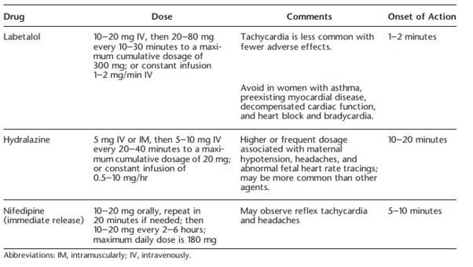

# Pregnancy

# CKD in pregnancy

## PENUT

[PENUT trial](Hingorani S, et al CJASN 2022; 17:1129-1138)

*Renal outcomes in prem babies \<28 weeks*

N= 832 \| 53% one abnormal renal parameter \|18%had an eGFR \<90, 36% had albuminuria, 22% HTN.

Gestational age (odds ratio, 0.94; 95% confidence interval, 0.89 to 0.99), birth weight *z*-score (odds ratio, 0.92; 95% confidence interval, 0.85 to 0.98), and prenatal steroids (odds ratio, 1.23; 95% confidence interval, 1.08 to 1.39) were associated with an eGFR \<90 ml/min per 1.73 m2

# HTN

-   2-8% of global pregnancy
-   Typically uses 140/90 as diagnostic threshold – measured twice 4 hours apart
-   pre 20 weeks = chronic
-   post 20 weeks = gestational ( with no proteinuria and features of preeclampsia)
    -   probably on a spectrum with pre-eclampsia
    -   50% of women with gestational hypertension will eventually develop proteinuria or other end-organ dysfunction consistent with the diagnosis of preeclampsia, and this progression is more likely when the hypertension is diagnosed before 32 weeks of gestation
    -   Elevated CVS risk
    -   Should be on Aspirin too

Guidelines superceeded by ACOG practice advisory post CHAP - **start Rx at 140/90**

Pathophysiology driven by various anti-angiogenic factors released from the placenta ( soluble FLT-1) - this is normal and required progression of pregnancy to help spiral arteries egress in preparation for non catastrophic detachment during delivery but if the pendulum swings too far can generate HTN/ endothelial damage and long term poorer CVS/Renal outcomes

## CHIPS

## CHAP

[Treatment for Mild Chronic Hypertension during Pregnancy](https://www.nejm.org/doi/10.1056/NEJMoa2201295)

-   open-label, multicenter, randomized trial

**Included**

-   mild chronic hypertension and singleton fetuses at a gestational age of less than 23 weeks
-   diabetics with no complications

**Excluded**

-   CKD, Diabetics with no complications

**Treatment**

-   antihypertensive medications recommended for use in pregnancy 

**Control**

-   no Rx unless severe hypertension (systolic pressure, ≥160 mm Hg; or diastolic pressure, ≥105 mm Hg) developed

**Primary outcome** 

-   Composite of preeclampsia with severe features, medically indicated preterm birth at less than 35 weeks’ gestation, placental abruption, or fetal or neonatal death

**Results**

-   n = 2408 women, >60% black, *very* high BMI | primary-outcome Rx vs Ctrl (30.2% vs. 37.0%), for an adjusted RR of 0.82 (95% confidence interval [CI], 0.74 to 0.92; P<0.001).
-   NNT 14.7
-   Preeclampsia:  24.4% and 31.1%, respectively (risk ratio, 0.79; 95% CI, 0.69 to 0.89), and the incidence of preterm birth was 27.5% and 31.4% (risk ratio, 0.87; 95% CI, 0.77 to 0.99
-   small for gestational age, maternal, neonatal adverse events - no difference
-   sub groups: age, diabetes, BMI, race, gestational vs chronic htn
-   the chronic HTN who were off meds at pregnancy seem to be important in outcome here but caution as its just a subgroup analysis and no p vals / CIs are wide and overlapping

**Limitations** 

- only 25% on aspirin at enrollment! should had been 100% given they are high risk (simply by HTN alone)
-   smallish difference in achieved BP  - a bit inconsistent with effect size noted (Mean BP in the active treatment group was 129.5/79.1 mmHg vs 132.6/81.5 mmHg in the standard treatment group, for a difference of 3.1 mmHg in the systolic BP and 2.3 mmHg in the diastolic BP.)
-   Gold standard measurement of BP - ?how clinically relevant is this?

**Take home**

-   Good enough to trigger an [ACOG practice advisory](https://www.acog.org/clinical/clinical-guidance/practice-advisory/articles/2022/04/clinical-guidance-for-the-integration-of-the-findings-of-the-chronic-hypertension-and-pregnancy-chap-study)

*ACOG recommends utilizing 140/90 as the threshold for initiation or titration of medical therapy for chronic hypertension in pregnancy, rather than the previously recommended threshold of 160/110*

# Preeclampsia

new-onset hypertension, which occurs most often after 20

weeks of gestation and frequently near term

\*\*i.e. if its \<20 weeks think about kidney disease rather than pre eclampsia\*\*

**Blood pressure**

Sys BP of 140 mm Hg or more or diastolic blood pressure of 90 mm Hg or more on two occasions at least 4 hours apart **after 20 weeks of gestation** in a woman with a previously normal blood pressure

**or**

Systolic blood pressure of 160 mm Hg or more or diastolic blood pressure of 110 mm Hg or more. (Severe hypertension can be confirmed within (minutes) to facilitate timely antihypertensive therapy, don’t wait 4 hours).

**And**

**Proteinuria**

-   300 mg or more per 24 hour urine collection (or this amount extrapolated from a timed collection) or
-   Protein/creatinine ratio of 0.3 mg/dL or more or
-   Dipstick reading of 2+ (used only if other quantitative methods not available)
    -   1+ false positive 71% of times
    -   3+ false positive 7%
-   Don’t always have to have proteinuria

*Or in the absence of proteinuria, new-onset hypertension with the new onset of any of the following:*

-   Thrombocytopenia: Platelet count less than 100
-   Renal insufficiency: Serum creatinine concentrations greater than 97 or a doubling of the serum creatinine concentration in the absence of other renal disease ( **NB very low baselines climbing within “normal” range**)
-   Impaired liver function: Elevated blood concentrations of liver transaminases to twice normal concentration or unexplained RUQ pain
-   Pulmonary oedema
-   New-onset headache unresponsive to medication and not accounted for by alternative diagnoses
-   visual symptoms

**Severe Preeclmapsia**: 160/110 twice & any of the additional signs/symptoms above.

Notes:

-   Headache is unreliable clinically, as is RUQ pain and epigastric pain
-   Alternative diagnoses if presenting earlier than 20 weeks:
-   TTP, HUS, molar pregnancy, renal disease or autoimmune disease
-   Most pre-eclampsia occurs in women with no risk factors (genetic/immune compatibility?)
-   Other risk factors:
    -   Nulliparity
    -   Multifetal gestations
    -   Preeclampsia in a previous pregnancy
    -   Chronic hypertension
    -   Pregestational diabetel, Gestational diabetes
    -   SLE
    -   Prepregnancy BMI greater than 30
    -   Antiphospholipid antibody syndrome
    -   Maternal age 35 years or older
    -   CKD
    -   Assisted reproductive technology
    -   OOSA

### AKI in eclampsia

glomerular endotheliosis consist of swollen, vacuolated endothelial cells with fibrils, swollen mesangial cells, subendothelial deposits of protein reabsorbed from the glomerular filtrate, and tubular casts

Oliguria in severe preeclampsia is a consequence of intrarenal vasospasm with an approximate 25% reduction in glomerular filtration rate

Transient oligouria is common

## HELLP

Typically, third trimester, but 30% of cases can be post partum

Can be atypical - 15% of the patients lack either hypertension or proteinuria

-   **LDH elevated \>600 IU/L or more**
-   **AST/ALT twice upper limit of normal**
-   **Plts\< 100**
-   RUQ pain in 90% of cases, nausea and vomiting in 50%

##Exclampsia

Convulsive manifestation of severe HTN

New-onset tonic-clonic, focal, or multifocal seizures in the absence of other causative conditions such as epilepsy, cerebral arterial ischemia and infarction, intracranial hemorrhage,

78-83% cerebral irritation such as severe and persistent occipital or frontal headaches, blurred vision, photophobia, and altered mental status

Not this often doesn’t behave as a linear progression and patients can present with seizure without prodromal htn/proteinuria (38% in UK)

1.9-3.2% of preeclampsia progresses in ctrl arms of trials

# Drugs

## Asprin

CKD = high risk = Aspirin

Cant use much. No ACEi/ARB, no immunosuppresion. 
