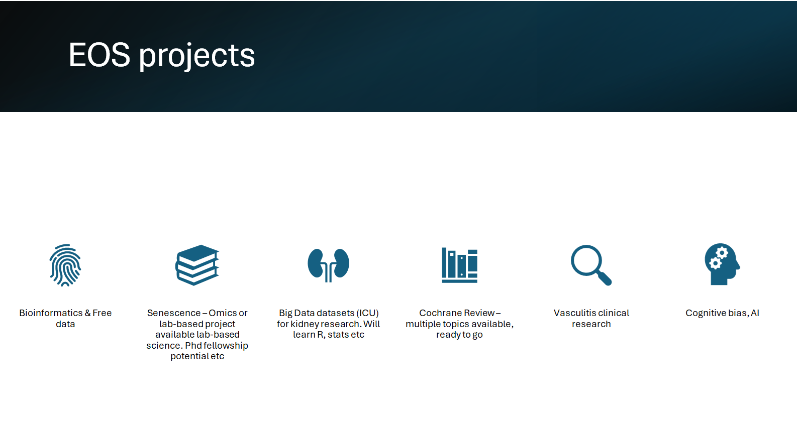

Kidney Health Services at Metro North has many excellent researchers that work on an array of topics, from basic science to clinical trials. Id encourage you to speak to several SMO's and to your supervisors to find the right project and team for you.

If you would like to discuss projects, AT projects, Masters, PhDs or anything else with me (Eoin) you are very welcome to do so and we can create a project that works for you. 

I have an interest in bioinformatics and senescence in particular, as well as using public data for research. Several clinical and vasculitis related projects are available as well as opportunities across a range of topics. 

## links

-   [My ORCID](https://orcid.org/0000-0002-7709-6595)

-   [Research gate](https://www.researchgate.net/profile/Eoin-Osullivan-8)

-   [UQ page](https://about.uq.edu.au/experts/45896)

