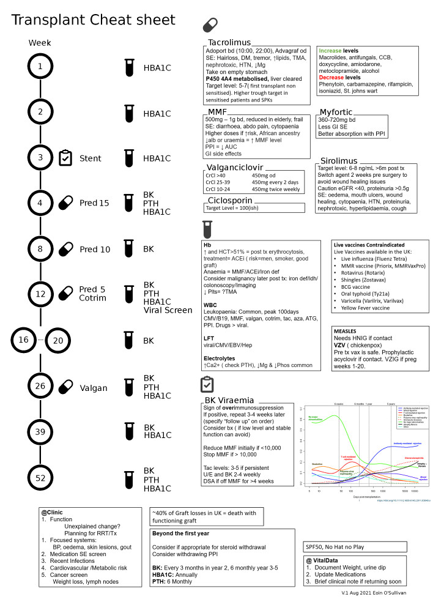

This is a cheat sheet I used from a previous role at Royal Infirmary of Edinburgh. 
Please be aware that transplant practice varies between and within countries, and is highly individualised to the patient. 
That said, it may be a useful starting point to a newcomer, to give a sense of a fairly typical regime and some generic thoughts about medications.

